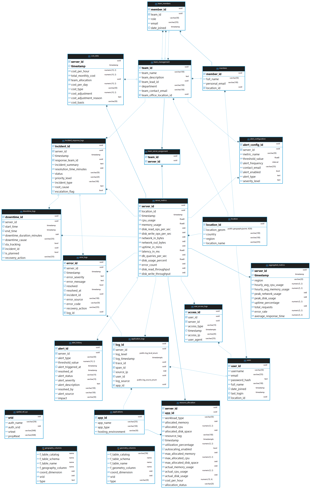

# Cloud Infrastructure Monitoring Database (CIMD)

## Overview
The **Cloud Infrastructure Monitoring Database (CIMD)** is a comprehensive data repository designed to facilitate robust cloud observability. Its architecture integrates a variety of data sources, including:

- **Aggregated Performance Metrics:** Summarized server performance data (CPU, memory, network, disk) over time, providing insights into resource utilization trends.
- **Real-time Server Metrics:** Granular, point-in-time data on server health and performance, enabling immediate issue detection.
- **Application Logs:** Detailed records of application behavior, errors, and events, crucial for debugging and understanding application flow.
- **Error Logs:** Specific records of system and application errors, facilitating root cause analysis.
- **User Access Logs:** Information on who is accessing which servers and when, enhancing security monitoring and auditing.
- **Alert Configurations:** Defined rules and thresholds for triggering notifications on critical events and performance deviations.
- **Alert History:** A log of all triggered alerts, their status, resolution times, and contributing factors.
- **Downtime Logs:** Records of system outages, their duration, causes, and planned/unplanned status, essential for SLA tracking.
- **Incident Response Logs:** A detailed history of incident management activities, including response teams, timelines, resolutions, and root causes.
- **Cost Data:** Information related to cloud resource consumption and associated costs, enabling cost optimization and tracking.
- **Resource Allocation:** Details on how resources (CPU, memory, disk) are allocated to different servers and applications.
- **Application Inventory:** A catalog of deployed applications, their types, and hosting environments.
- **Server Inventory:** Basic information about the monitored servers (implicitly through `server_id` across tables).
- **Team Management:** Information about teams responsible for different aspects of the infrastructure.
- **Team Members:** Details about individual team members and their roles.
- **Team Server Assignments:** Records of which teams are responsible for specific servers.
- **Location Data:** Geographic information associated with servers and potentially users.

By centralizing and structuring this diverse data, the CIMD aims to provide a holistic view of cloud infrastructure health, facilitate proactive alerting, accelerate incident resolution, optimize resource utilization, and enable data-driven decision-making for improved reliability and performance.

## Technology Stack (To Date)
- **Database**: PostgreSQL RDBMS (hosted on Oracle Cloud's free-tier VM Instance)
* **Database Management Tool:** DBeaver
- **Backend**: Python (For scripting)
- **Frontend**: NA
- **Cloud Integration**: Yes - Oracle Cloud (Free Tier; As this is a project)

**Manual Cloud VM and Database Setup**
All infrastructure and database setup for this project was performed manually on a cloud Virtual Machine instance. This deliberate approach involved provisioning the VM, configuring the operating system, installing and configuring PostgreSQL, and setting up the database schema entirely through command-line interfaces and SQL scripting. This hands-on process was chosen to explicitly demonstrate my proficiency in cloud infrastructure fundamentals, PostgreSQL administration, SQL scripting, and system integration, without reliance on automated deployment tools or managed database services.

Detailed steps and relevant command outputs are documented in [detailed_cloud_setup_documentation](database/cloud_setup).

## Key Features
This Cloud Infrastructure Monitoring Database (CIMD) is designed to provide comprehensive insights into the health and performance of your cloud infrastructure, with a unique emphasis on granular geospatial data. Key features include:

- **Comprehensive Infrastructure Monitoring:** Tracks essential server metrics such as CPU usage, memory utilization, disk I/O, network throughput, and uptime, providing a holistic view of your infrastructure's performance.
- **Granular, Coordinate-Level Geospatial Data:** This database is engineered to store and leverage precise, coordinate-level geographic data for each monitored infrastructure component, offering a level of spatial detail beyond traditional CIMDs.
- **Scalable Database Design:** Built with PostgreSQL and optimized for time-series data, the database schema (including tables for Instances, Metrics, Alerts, and Logs) is designed for efficient storage and retrieval of large volumes of monitoring data.
- **Real-time Data Ingestion via Telegraf:** Leverages the industry-standard Telegraf agent for efficient and reliable collection of server metrics, enabling near real-time visibility into infrastructure performance. Direct integration with PostgreSQL ensures seamless data flow.
- **Robust Data Relationships:** Implements primary and foreign key constraints to establish clear relationships between monitored entities (Instances, Metrics, Alerts, Logs), ensuring data integrity and facilitating insightful querying.
- **Optimized for Performance:** Includes indexing on key columns (e.g., timestamps, instance IDs) to ensure efficient query performance, crucial for real-time analysis and historical trend identification.
- **Extensible Architecture:** The database schema and data ingestion pipeline are designed to be extensible, allowing for the addition of new metrics, monitored entities, and data sources as your infrastructure evolves.
- **Clear Documentation:** Comprehensive documentation, including an Entity-Relationship Diagram (ERD), schema descriptions, and deployment guides, showcases a professional and well-understood database setup.
- **Targeted Advantage:** The provision of granular geospatial data makes this CIMD particularly advantageous for specific industries, such as logistics, telecommunications, and smart cities, that require precise location intelligence for their infrastructure, offering a distinct benefit over general-purpose tools like Datadog and AWS CloudWatch in these contexts.
- **Industry-Standard Tooling:** Utilizes popular and reliable tools like PostgreSQL for the database and Telegraf for data ingestion, demonstrating familiarity with industry best practices and technologies.

## Potential Use Cases: Comprehensive Cloud Infrastructure Monitoring with Enhanced Geospatial Insights
While a key differentiator of this CIMD lies in its granular, coordinate-level geospatial data, its core functionality extends to provide comprehensive monitoring of cloud infrastructure performance and health, similar to established tools like Datadog and AWS CloudWatch. The unique geospatial advantage enhances these traditional monitoring capabilities, enabling a richer understanding and more targeted actions. Here are potential use cases across various sectors:

**Core Infrastructure Monitoring (Across all Industries):**
- **Real-time Performance Monitoring:** Track standard server metrics (CPU usage, memory utilization, disk I/O, network throughput) across your entire cloud infrastructure, gaining immediate visibility into potential bottlenecks or performance degradation, regardless of server location.
- **Alerting and Notifications:** Configure intelligent alerts based on thresholds for various metrics, ensuring timely notifications of critical issues to the appropriate teams, with the added context of the affected server's precise geographic location for faster identification.
- **Historical Trend Analysis:** Analyze historical performance data across your infrastructure, identifying trends and patterns to aid in capacity planning, resource optimization, and proactive issue prevention, with the ability to segment data by geographic location.
- **Log Aggregation and Analysis:** Centralize and analyze logs from all your cloud infrastructure components, facilitating faster troubleshooting and providing insights into system behavior, with the ability to filter and analyze logs based on specific geographic coordinates.
- **Health Checks and Availability Monitoring:** Continuously monitor the availability and health of your servers and applications, receiving alerts for downtime or service disruptions, with precise location data to understand the scope of geographically isolated incidents.

**Leveraging the Unique Geospatial Advantage (Specific Use Cases):**
- **Latency Optimization with Geographic Awareness:** Identify and address latency issues by correlating performance data with the physical distance between users and servers, enabling strategic infrastructure placement or content delivery network (CDN) optimization based on precise geographic insights.
- **Geofenced Compliance and Regulatory Monitoring:** Track infrastructure performance and access patterns within specific geographic boundaries to ensure adherence to local regulations and data sovereignty requirements, with detailed location-based audit trails.
- **Enhanced Asset Management:** Maintain a precise inventory of your physical server locations, facilitating asset tracking, capacity planning for specific geographic regions, and efficient management of geographically distributed infrastructure.
- **Optimized Resource Allocation Based on Location:** Analyze resource utilization patterns across different geographic locations to identify areas with high demand or underutilized infrastructure, enabling more efficient allocation and cost optimization.
- **Disaster Recovery with Location Context:** During outages or disaster events, quickly identify the geographic scope of impact on your infrastructure, enabling targeted recovery efforts and prioritization of resources based on the precise location of affected systems.

By integrating comprehensive cloud infrastructure monitoring capabilities with granular, coordinate-level geospatial data, this CIMD provides a powerful and differentiated solution for organizations seeking deeper insights, more targeted actions, and a unique understanding of their geographically distributed infrastructure. While offering the core functionalities of traditional CIMDs, the added spatial dimension unlocks a new layer of operational intelligence and optimization possibilities.

## Database Schema
For a detailed overview of the database schema, including table descriptions and column definitions, please refer to [Database Architecture](database/db_architecture.md)

## Entity Relationship Diagram

## Setup
Fully documented here: [Database_Documentation](database)

## Data Ingestion (Telegraf):
Brief description of scripts/ methods for pupulating db with data (TO BE ADDED; Data Ingestion will be done with Telegraf)

## Complete Project Plan (Last updated May 18,2025)

## Future Enhancements:
TO BE ADDED IN THE FUTURE (Project is still in progress)

## Contact:
Feel free to contact me through any of the below whether it be to have a casual conversation or for any work opportunities or collaborations.

- email: burhanezzy8@gmail.com
- linkedin: https://www.linkedin.com/in/ezzyburhan/
