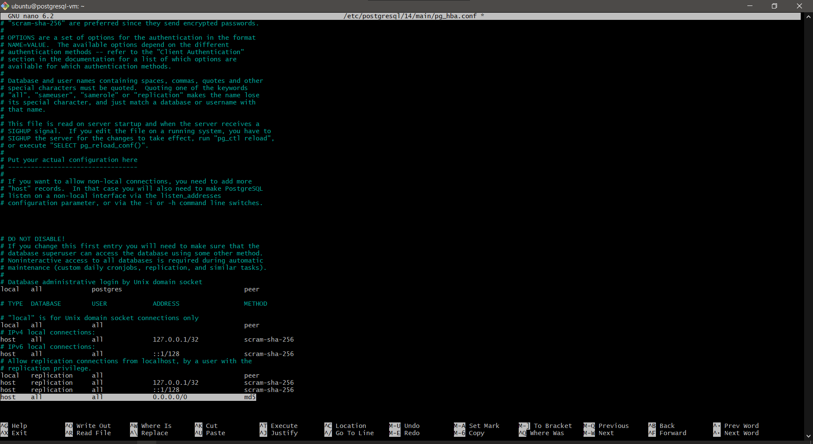

# Connecting and Setting Up PostgreSQL on the Oracle Cloud Instance
## **Prerequisites**
- Oracle Cloud Ubuntu instance already created.
- SSH access is working (using .pem key).
- This guide starts after instance creation and SSH connection is successful.

1. Connect to Your Instance via SSH
SSH into your instance from your local machine:

bash
ssh -i "/c/Users/burha/.ssh/cimd_postgresql_key" ubuntu@<public_ip>
Replace <public_ip> with your instance’s public IP address.

This lets you log into the Ubuntu server remotely.

2. Update the Package Manager and Install PostgreSQL
Run these commands to update packages and install PostgreSQL:

bash
sudo apt update
sudo apt install postgresql postgresql-contrib -y

postgresql: The main PostgreSQL database server.

postgresql-contrib: Adds useful additional features like extensions.

3. ▶️ Start and Enable PostgreSQL Service
Make sure PostgreSQL starts now and on every reboot:

bash
Copy
Edit
sudo systemctl enable postgresql
sudo systemctl start postgresql
sudo systemctl status postgresql

The status command confirms that the PostgreSQL server is running.

4. 🧑‍💻 Access PostgreSQL CLI as Default User
PostgreSQL creates a default system user named postgres. Switch to it:

bash
Copy
Edit
sudo -i -u postgres

Now enter the PostgreSQL shell:

bash
Copy
Edit
psql

5. 🗃️ Create Your Database and User
Inside the psql shell, run:

sql
Copy
Edit
CREATE DATABASE cimd;
CREATE USER cimd_user WITH ENCRYPTED PASSWORD 'your_password';
GRANT ALL PRIVILEGES ON DATABASE cimd TO cimd_user;

cimd: your database name.

cimd_user: the user that will access the database.

'your_password': choose a strong password.

Then exit:

sql
Copy
Edit
\q
exit

6. 🌍 Allow Remote Connections to PostgreSQL (Optional but Needed for Remote Tools)
a. Modify the PostgreSQL Configuration
Edit postgresql.conf to allow PostgreSQL to listen to external IPs:

    BUT FIRST, before the command below, you need to install nano if you havent already
    Install nano (recommended for simplicity)
    
    bash
    Copy
    Edit
    sudo apt update
    sudo apt install nano -y

bash
Copy
Edit
sudo nano /etc/postgresql/14/main/postgresql.conf

Find and change:

ini
Copy
Edit
listen_addresses = 'localhost'
To:

ini
Copy
Edit
listen_addresses = '*'

This tells PostgreSQL to accept connections from all IPs.

To save and exit the file in nano, follow these steps:

After editing (e.g., setting listen_addresses = '*'), press:
Ctrl + O → (this writes/saves the file)

You'll be prompted at the bottom:
File Name to Write: /etc/postgresql/14/main/postgresql.conf
Just press Enter to confirm.

Then press:
Ctrl + X → (this exits the editor)

b. Edit Client Authentication File
Allow clients to authenticate:

bash
Copy
Edit
sudo nano /etc/postgresql/14/main/pg_hba.conf
Add this line at the bottom:

css
Copy
Edit
host    all             all             0.0.0.0/0               md5

This allows all external IPs to connect using password authentication.

Save and exit. Then restart PostgreSQL:

bash
Copy
Edit
sudo systemctl restart postgresql

7. 🔐 Add Ingress Rule in Oracle Cloud (For Port 5432)
To allow PostgreSQL traffic into your server:

Go to VCN > Security Lists > Your Security List.

Add an Ingress Rule:

Source CIDR: 0.0.0.0/0 (or your IP for security)

IP Protocol: TCP

Destination Port Range: 5432

This tells Oracle Cloud to allow PostgreSQL traffic.

8. 🧪 Test the Connection From Local Machine
Use pgAdmin, DBeaver, or terminal psql to connect:

Host: <public_ip>

Port: 5432

Database: cimd

User: cimd_user

Password: 'your_password'

        To connect your local machine to the PostgreSQL database hosted on your cloud VM, you need to make sure:

        PostgreSQL is listening for remote connections

        The server accepts external client IPs

        The cloud VM's port 5432 is open to your local IP

        ✅ Step-by-Step Guide
        1. Edit postgresql.conf
        This file controls where PostgreSQL listens for connections.

        SSH into your cloud VM (where your PostgreSQL server is running):

        bash
        Copy
        Edit
        ssh -i "/c/Users/burha/.ssh/cimd_postgresql_key" ubuntu@<your_public_ip>

        Command:

        bash
        Copy
        Edit
        sudo nano /etc/postgresql/14/main/postgresql.conf
        Find and modify this line:

        ini
        Copy
        Edit
        listen_addresses = '*'
        This allows PostgreSQL to accept connections from any IP address.

        Save and exit:

        Ctrl + O → save

        Enter → confirm

        Ctrl + X → exit

        ✅ Recommended: Use 'localhost' for local-only, or '*' for public testing. For production, prefer using specific IPs or private networks.

        2. Edit pg_hba.conf
        This file controls who can connect, from where, and how.

        Command:

        bash
        Copy
        Edit
        sudo nano /etc/postgresql/14/main/pg_hba.conf
        Add this line to the bottom:

        css
        Copy
        Edit
        host    all             all             0.0.0.0/0               md5
        Explanation:

        host → enables TCP/IP connections

        all → any database

        all → any user

        0.0.0.0/0 → any IP address (you can restrict this later)

        md5 → use password authentication

        ⚠️ For security, change 0.0.0.0/0 to your own IP address, like 203.0.113.10/32 for production use.

        3. Restart PostgreSQL
        Apply the changes:

        bash
        Copy
        Edit
        sudo systemctl restart postgresql
        4. Allow Port 5432 in Oracle Cloud
        Ensure port 5432 is open to the public or your IP:

        Go to VCN → Security Lists

        Edit Ingress Rules

        Source CIDR: 0.0.0.0/0 (or your IP with /32)

        Destination Port: 5432

        Protocol: TCP

        🧪 5. Test the Connection
        Now connect using:

        pgAdmin / DBeaver

        Or terminal:

        bash
        Copy
        Edit
        psql -h <public_ip> -U cimd_user -d cimd
        You’ll be prompted for your password.

        🔐 Security Notes
        For testing, 0.0.0.0/0 is fine, but for production:

        Use firewalls

        Restrict by IP

        Use SSH tunneling if needed

