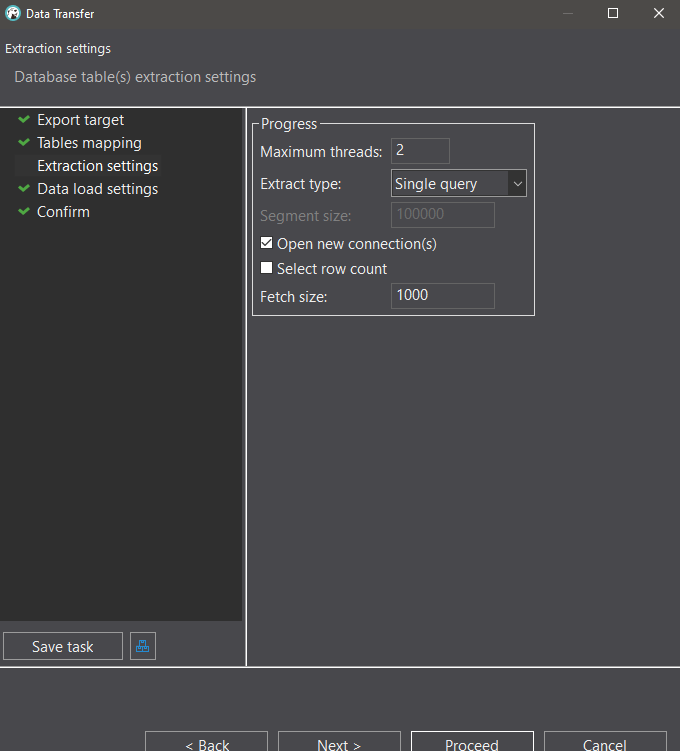
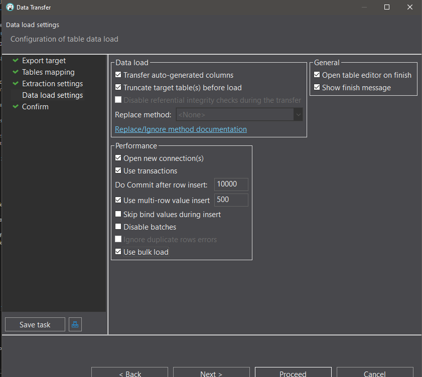

# Migrate Local DB to Cloud VM via DBeaver
- Prerequisites
   - You’ve connected DBeaver to both:
   - Your local PostgreSQL DB
   - Your cloud PostgreSQL DB (via SSH tunnel, port 15432)
   - You’ve reset your postgres password and can connect

🥇 Step 1: Select tables from the source (your local DB)
In the Database Navigator panel, expand your local PostgreSQL connection.

Navigate to your schema (usually public).

Multi-select all the tables you want to export (hold Ctrl or Shift while clicking).

Right-click → Select Export Data.

🥈 Step 2: Choose "Database" as the transfer type
In the Export Data wizard:

Target = Database

Click Next.

🥉 Step 3: Configure the target (cloud PostgreSQL)
Under Target container, choose your cloud PostgreSQL connection from the list.

Select the right schema (e.g., public) where you want to place the tables.

DBeaver will automatically map source tables to target tables. You can review/adjust mappings.

⚠️ If tables already exist in the cloud DB:

You can choose to overwrite, append, or skip data (you’ll see these options in the next step).

🛠️ Step 4: Extraction Settings (optimal configuration; the specifcs or UI may change as DBeaver updates regularly):

Max Threads: Set to 2-4 (depending on your computer's capabilities)
Extract Type: Use Single query for smaller tables (this is simpler and works well for most cases)
Use Multiple queries for very large tables, as this helps prevent timeout issues and memory problems
Open new connections: ✅ Keep checked
Fetch size: 10000 is good (lower to 1000 if memory limited)

🛠️ Step 4.5: Data Load Settings (optimal configuration):

Transfer auto-generated columns: ✅ Check if you want to preserve IDs
Truncate target tables: ✅ Only if you want to replace existing data
Use transactions: ✅ Keep checked for safety
Use multi-row value insert: ✅ Keep checked for better performance
Use bulk load: ✅ Check this for fastest PostgreSQL performance

🔍 Step 5: Review and Start
Click Next and review the summary.

Then click Start to begin the transfer.

💡 You’ll see a progress bar, and logs of what's happening. If there are any errors (e.g., conflicts, missing target tables), they will be shown.

Error I was hit by:
1. Can't find specified data type by name: 'public.geography' - This was an easy one, this happened because I didnt install postgis (a postgresql extension for geospatial data features), so I need to simply install it on the cloud VM postgresql. code:

bash
sudo apt update
sudo apt install postgresql-14-postgis-3 -y

and then run (in DBeaver script on the VM connection)
CREATE EXTENSION postgis;

There may be other dependency extensions you may have to install prior to transfer. What you should do is run your scripts that have all the extensions you installed (hopefully you have a script that specificially has all the extensions you installed); My CREATE.sql file was where I had all the extensions installed. Simply open up that file, and in the toolbar, change the active data source to the target db (your cloud vm db).

Once done, retry the data transfer. 

✅ Result:
Once the process is complete, your local database structure and data will now be on your cloud PostgreSQL instance. You can switch to that connection in DBeaver and run queries or visualize your data — just as if it were local.

**This is where cloud_setup (atleast the basic setup) is complete.**