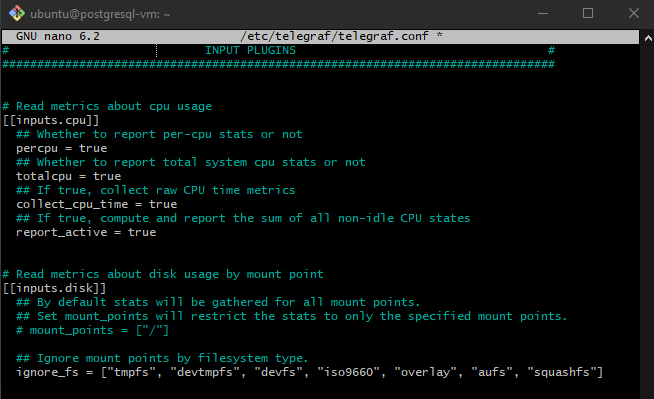
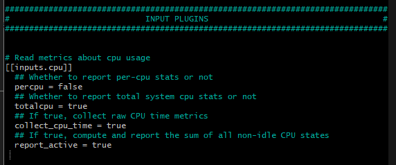
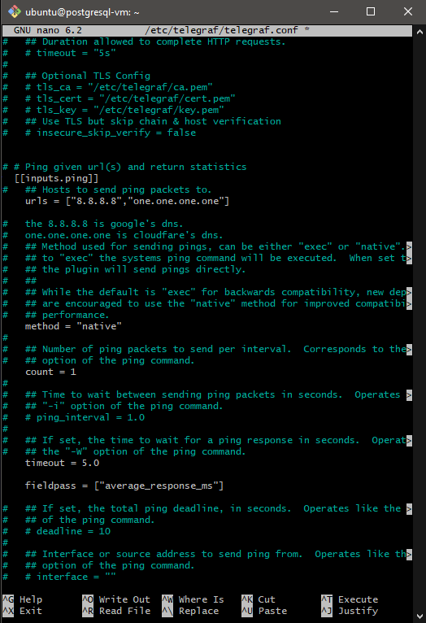

# Telegraf Setup on Ubuntu 22.04.5 LTS

## IMPORTANT COMMANDS

```bash
# Check the I/O configurations
sudo nano /etc/telegraf/telegraf.conf

# Test Telegraf configuration
telegraf --test

# List available outputs
telegraf --list-outputs
```

---

## Step 1: Install Telegraf

1. **SSH into your Ubuntu server.**
2. **Update package lists:**
    ```bash
    sudo apt update
    ```
3. **Install Telegraf:**
    ```bash
    sudo apt install telegraf
    ```
4. **Verify installation (optional):**
    ```bash
    telegraf --version
    ```
    *Example version: Telegraf 1.21.4+ds1-0ubuntu2*

---

## Step 2: Configure Telegraf

The main configuration file is at `/etc/telegraf/telegraf.conf`.

```bash
sudo nano /etc/telegraf/telegraf.conf
```

### Review `[agent]` Settings

- Check the `[agent]` section for global options (interval, hostname, etc.).

### Enable Input Plugins

Uncomment and configure the following input plugins:

#### CPU

```toml
[[inputs.cpu]]
# Default settings are generally sufficient
```

#### Memory

```toml
[[inputs.mem]]
```

#### Disk

```toml
[[inputs.disk]]
ignore_fs = ["tmpfs", "devtmpfs", "devfs", "iso9660", "overlay", "aufs", "squashfs"]
```

#### Disk I/O

```toml
[[inputs.diskio]]
# devices = ["sda", "vda"] # Uncomment and specify if needed
```

#### Network

```toml
[[inputs.net]]
# interfaces = ["eth0", "ens*"] # Uncomment and specify if needed
```

#### System

```toml
[[inputs.system]]
```

---



---

### Configure Output Plugin (PostgreSQL)

Add at the end of `telegraf.conf`:

```toml
[[outputs.postgresql]]
  host = "<your_cloud_db_endpoint>"
  port = 5432
  database = "<your_database_name>"
  user = "<your_db_username>"
  password = "<your_db_password>"
  sslmode = "require" # Or "disable" if SSL is not configured

  ## Default table for metrics
  table = "metrics"

  ## How are tags and fields stored
  tag_columns = ["host"]
  field_columns = [
    "usage_user", "usage_system", "usage_idle", "used", "free",
    "read_count", "write_count", "read_bytes", "write_bytes",
    "bytes_sent", "bytes_recv", "uptime"
  ]

  ## Timestamp configuration
  timestamp_column = "timestamp"
  timestamp_format = "timestamp"
```

> **Note:** Replace `<placeholders>` with your actual PostgreSQL details. Adjust `field_columns` as needed.

---

## Understanding Telegraf Tags and Fields

- **Fields:** Actual metric values (e.g., `cpu_usage`, `memory_usage`, `disk_read_ops_per_sec`, `network_in_bytes`, `uptime_in_mins`).
- **Tags:** Metadata/context (e.g., `host`, `cpu`, `interface`).

### Example: Adding Custom Tags

If you need custom tags like `server_id` or `region`:

```toml
[[processors.add_tag]]
  namepass = ["cpu", "mem", "disk", "net"]
  tags = { "region" = "us-east-1" }

[[processors.add_tag]]
  namepass = ["cpu", "mem", "disk", "net"]
  tags = { "server_id" = "your_static_server_id" }
```

Include them in `tag_columns`:

```toml
tag_columns = ["host", "region", "server_id"]
```

---

## Save and Close the Configuration

- Press `Ctrl+X`, then `Y`, then `Enter`.

---

## My Specific Telegraf Configuration Process

- The `telegraf.conf` file configures both input (what data to collect) and output (what data to send to the database).
- Only enable necessary input plugins for efficiency.
- Use `fieldpass` to limit collected fields.

### Fieldpass for Inputs

- **CPU:** `fieldpass = ["usage_active"]`
- **Disk:** `fieldpass = ["used_percent"]`
- **DiskIO:** `fieldpass = ["reads", "writes", "read_bytes", "write_bytes"]`
- **Kernel:** `fieldpass = ["boot_time"]`
- **Memory:** `fieldpass = ["used_percent"]`
- **System:** `fieldpass = ["uptime"]`
- **Network:** `fieldpass = ["bytes_recv", "bytes_sent", "err_in", "err_out"]`
- **Ping:** `fieldpass = ["average_response_ms"]`

> For `inputs.ping`, set:
> ```toml
> urls = ["<target_url_or_ip>"]
> count = 1
> ```

---



- Reference for CPU input fields: [Telegraf CPU Input Plugin Docs](https://github.com/influxdata/telegraf/blob/release-1.34/plugins/inputs/cpu/README.md)

---

## Telegraf Configuration for NGINX Web Server Application Logs
See details in [elasticsearch_setup_for_ingesting_web_server_data](07.elasticsearch_setup.md)

## Setting up the telgraf outputs for postgreSQL

| server_metrics Column     | Telegraf Field/Source            |
|--------------------------|----------------------------------|
| timestamp                | Telegraf auto-generated          |
| cpu_usage                | cpu.usage_active                 |
| memory_usage             | mem.used_percent                 |
| disk_usage_percent       | disk.used_percent                |
| disk_read_ops_per_sec    | diskio.reads                     |
| disk_write_ops_per_sec   | diskio.writes                    |
| disk_read_throughput     | diskio.read_bytes                |
| disk_write_throughput    | diskio.write_bytes               |
| network_in_bytes         | net.bytes_recv                   |
| network_out_bytes        | net.bytes_sent                   |
| uptime_in_mins           | system.uptime (converted)        |
| latency_in_ms            | ping.average_response_ms         |
| error_count              | net.err_in + net.err_out         |
| server_id                | Static tag or extracted hostname |
| location_id              | Static tag (you define per host) |


name_override for mem and disk inputs
Add this to your telegraf.conf:

# Telegraf to PostgreSQL Integration Documentation

## Problem Statement

We needed to configure Telegraf to collect system metrics and store them in a specific PostgreSQL table with a predefined schema. The challenge was mapping Telegraf's default metric names and structure to our custom database schema.

## Initial Setup

### Starting Point
- **Telegraf version**: 1.34.4
- **PostgreSQL**: Running on localhost:15432
- **Goal**: Store system metrics in a custom table structure

### Existing PostgreSQL Table Schema
```sql
CREATE TABLE public.server_metrics (
    server_id uuid NOT NULL,
    location_id uuid NOT NULL,
    "timestamp" timestamp NOT NULL,
    cpu_usage float8 NOT NULL,
    memory_usage float8 NOT NULL,
    disk_read_ops_per_sec int4 NOT NULL,
    disk_write_ops_per_sec int4 NOT NULL,
    network_in_bytes int8 NOT NULL,
    network_out_bytes int8 NOT NULL,
    uptime_in_mins int4 NOT NULL,
    latency_in_ms float8 NOT NULL,
    disk_usage_percent float8 NOT NULL,
    error_count int4 NULL,
    disk_read_throughput int8 NOT NULL,
    disk_write_throughput int8 NOT NULL,
    CONSTRAINT server_metrics_pkey PRIMARY KEY (server_id),
    CONSTRAINT f_key_location_id_to_location FOREIGN KEY (location_id) 
        REFERENCES public."location"(location_id) ON DELETE CASCADE
);
```

## Challenges Encountered

### 1. PostgreSQL Output Plugin Limitations
**Initial Approach**: Used `outputs.postgresql` plugin with custom field mappings
```toml
[[outputs.postgresql]]
  connection = "..."
  table = "server_metrics"
  tag_columns = ["server_id", "location_id"]
  field_columns = [...]
```

**Problem**: Configuration fields like `table`, `create_table`, `tag_columns`, `field_columns`, `timestamp_column`, `timestamp_format` were not supported in our Telegraf version.

**Error**: 
```
configuration specified the fields [...] but they were not used; this is either a typo or this config option does not exist in this version
```

### 2. SQL Output Plugin Limitations
**Second Approach**: Tried `outputs.sql` plugin with custom templates
```toml
[[outputs.sql]]
  driver = "postgres"
  table_creation_template = '''...'''
  insert_template = '''...'''
```

**Problem**: Custom template fields (`table_creation_template`, `insert_template`) were also not supported in our version.

## Final Solution

### Architecture Overview
We implemented a two-part solution:
1. **Telegraf** → JSON file output
2. **Python script** → Processes JSON and inserts into PostgreSQL

### Part 1: Telegraf Configuration

#### Input Plugins
Configured to collect essential system metrics:
- `inputs.cpu` - CPU usage
- `inputs.mem` - Memory usage  
- `inputs.disk` - Disk usage percentage
- `inputs.diskio` - Disk I/O operations and throughput
- `inputs.net` - Network traffic
- `inputs.system` - System uptime
- `inputs.ping` - Network latency

#### Processors (Data Transformation)
Used multiple processors to transform default Telegraf field names to match our database schema:

```toml
# Rename memory field
[[processors.rename]]
  namepass = ["mem"]
  [[processors.rename.replace]]
    field = "used_percent"
    dest = "used_percent_mem"

# Rename disk field
[[processors.rename]]
  namepass = ["disk"]
  [[processors.rename.replace]]
    field = "used_percent"
    dest = "disk_usage_percent"

# Map CPU field
[[processors.rename]]
  namepass = ["cpu"]
  [[processors.rename.replace]]
    field = "usage_active"
    dest = "cpu_usage"

# Map disk I/O fields
[[processors.rename]]
  namepass = ["diskio"]
  [[processors.rename.replace]]
    field = "reads"
    dest = "disk_read_ops_per_sec"
  [[processors.rename.replace]]
    field = "writes"
    dest = "disk_write_ops_per_sec"
  [[processors.rename.replace]]
    field = "read_bytes"
    dest = "disk_read_throughput"
  [[processors.rename.replace]]
    field = "write_bytes"
    dest = "disk_write_throughput"

# Map network fields
[[processors.rename]]
  namepass = ["net"]
  [[processors.rename.replace]]
    field = "bytes_recv"
    dest = "network_in_bytes"
  [[processors.rename.replace]]
    field = "bytes_sent"
    dest = "network_out_bytes"

# Map ping field
[[processors.rename]]
  namepass = ["ping"]
  [[processors.rename.replace]]
    field = "average_response_ms"
    dest = "latency_in_ms"
```

#### Custom Field Calculations
Used Starlark processor to create calculated fields:
```toml
[[processors.starlark]]
  namepass = ["cpu", "mem", "disk", "net"]
  source = '''
def apply(metric):
    if "uptime" in metric.fields:
        metric.fields["uptime_in_mins"] = int(metric.fields["uptime"] / 60)
    if "err_in" in metric.fields and "err_out" in metric.fields:
        metric.fields["error_count"] = int(metric.fields["err_in"] + metric.fields["err_out"])
    return metric
'''
```

#### Global Tags
Set consistent identifiers for the server:
```toml
[global_tags]
  location_id = "550e8400-e29b-41d4-a716-446655440001"
  server_id = "550e8400-e29b-41d4-a716-446655440000"
```

#### Output Configuration
```toml
[[outputs.file]]
  files = ["/tmp/telegraf_metrics.json"]
  data_format = "json"
  json_timestamp_units = "1s"
```

### Part 2: Python Integration Script

Created a Python daemon that:
1. Monitors the JSON file for new metrics
2. Groups metrics by timestamp and server
3. Maps field names to database columns
4. Performs UPSERT operations to PostgreSQL

#### Key Features
- **Batch Processing**: Groups multiple metrics into single database records
- **Field Mapping**: Translates Telegraf field names to database column names
- **Error Handling**: Robust connection and error management
- **UPSERT Logic**: Updates existing records based on server_id primary key
- **UUID Handling**: Properly casts string UUIDs to PostgreSQL UUID type
- **Default Values**: Handles NULL values with appropriate defaults for NOT NULL fields

#### Field Mapping Table
| Telegraf Metric | Telegraf Field | Database Column |
|----------------|----------------|-----------------|
| cpu | cpu_usage | cpu_usage |
| mem | used_percent_mem | memory_usage |
| disk | disk_usage_percent | disk_usage_percent |
| diskio | disk_read_ops_per_sec | disk_read_ops_per_sec |
| diskio | disk_write_ops_per_sec | disk_write_ops_per_sec |
| diskio | disk_read_throughput | disk_read_throughput |
| diskio | disk_write_throughput | disk_write_throughput |
| net | network_in_bytes | network_in_bytes |
| net | network_out_bytes | network_out_bytes |
| net | error_count | error_count |
| system | uptime_in_mins | uptime_in_mins |
| ping | latency_in_ms | latency_in_ms |

## Implementation Steps

1. **Install Dependencies**:
   ```bash
   sudo apt install python3-pip
   pip3 install psycopg2-binary
   ```

2. **Create Location Record** (if needed):
   ```sql
   INSERT INTO public.location (location_id, location_name) 
   VALUES ('550e8400-e29b-41d4-a716-446655440001', 'Default Location')
   ON CONFLICT (location_id) DO NOTHING;
   ```

3. **Deploy Configuration**:
   - Save Telegraf config to `/etc/telegraf/telegraf.conf`
   - Save Python script to `/usr/local/bin/postgres_inserter.py`
   - Make Python script executable: `chmod +x /usr/local/bin/postgres_inserter.py`

4. **Test Configuration**:
   ```bash
   telegraf --config /etc/telegraf/telegraf.conf --test
   ```

5. **Start Services**:
   ```bash
   # Start Python processor
   python3 /usr/local/bin/postgres_inserter.py &
   
   # Start Telegraf
   sudo systemctl start telegraf
   ```

## Validation

### Successful Test Output
The working configuration produces output like:
```
> mem,host=postgresql-vm,location_id=550e8400-e29b-41d4-a716-446655440001,server_id=550e8400-e29b-41d4-a716-446655440000 used_percent_mem=19.957620371617896
> net,host=postgresql-vm,interface=ens3,location_id=550e8400-e29b-41d4-a716-446655440001,server_id=550e8400-e29b-41d4-a716-446655440000 network_in_bytes=304067772u,network_out_bytes=80583673u,error_count=0i
> diskio,host=postgresql-vm,location_id=550e8400-e29b-41d4-a716-446655440001,name=sda,server_id=550e8400-e29b-41d4-a716-446655440000 disk_read_ops_per_sec=544897u,disk_read_throughput=140859763200u,disk_write_ops_per_sec=982144u,disk_write_throughput=9035488256u
```

## Lessons Learned

1. **Version Compatibility**: Always check Telegraf plugin documentation for your specific version
2. **Intermediate Processing**: When direct plugins don't support complex mappings, file + script approach provides flexibility
3. **Field Naming**: Telegraf's default field names rarely match custom database schemas
4. **Data Types**: Pay attention to PostgreSQL data type requirements (UUID casting, NOT NULL constraints)
5. **Testing**: Use `--test` mode extensively to validate configuration before deployment

## Alternative Approaches Considered

1. **InfluxDB Intermediate**: Use InfluxDB as intermediate storage, then ETL to PostgreSQL
2. **HTTP Output**: Create custom API endpoint to handle PostgreSQL insertion
3. **External ETL**: Use tools like Apache NiFi or Logstash for data transformation

The file + Python script approach was chosen for its simplicity and direct control over the data transformation process.


## Step 3: Start and Enable Telegraf



```bash
# Start Telegraf
sudo systemctl start telegraf

# Enable Telegraf to start on boot
sudo systemctl enable telegraf

# Check Telegraf status
sudo systemctl status telegraf
```

- If there are errors, check logs:
    ```bash
    journalctl -u telegraf
    ```

---

## Next Steps

1. **Verify Data in PostgreSQL:**  
   Connect using DBeaver or `psql` and query the `metrics` table.

2. **Adjust Table Schema:**  
   If columns don't align, alter the table schema.

3. **Refine Telegraf Configuration:**  
   Adjust `field_columns` as needed.

4. **Address Specific Metrics:**  
   Investigate collection of metrics like `latency_in_ms`, `db_queries_per_sec`, and `error_count`.

---

This guide should help you get Telegraf running on Ubuntu 22.04.5 LTS and sending data to your PostgreSQL database. Let me know if you encounter any issues!

----------------------
Below is actually reconfiguring and creating a python script so tht telegraf data is properly inserted into the database


