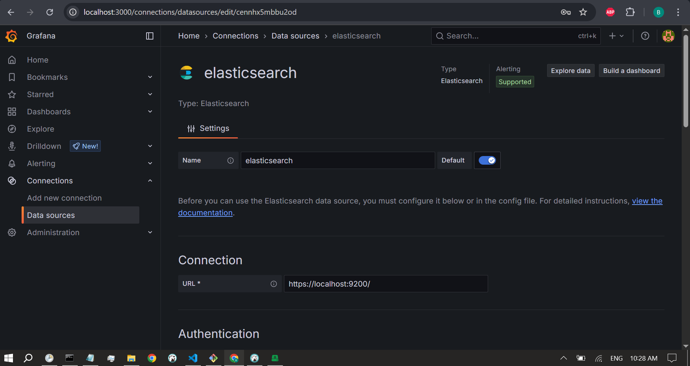
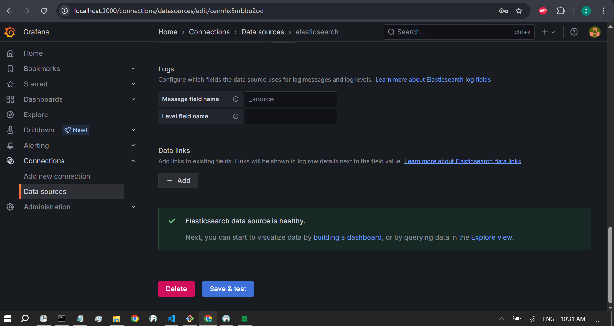

# Grafana Setup (Local Laptop) to Monitor Remote VM via Elasticsearch
## Prerequisites
Elasticsearch is running on the remote VM.

Telegraf is pushing metrics to Elasticsearch.

A reverse SSH tunnel is active: localhost:9200 on your local laptop forwards to Elasticsearch on the VM.

Grafana is installed locally. (https://grafana.com/grafana/download/)

1. Start Elasticsearch and SSH Tunnel on Local Laptop
Create and run a .bat script like this:

bat
Copy
Edit
@echo off

REM === Start Elasticsearch in background ===
start /b "" "C:\Path\To\elasticsearch.bat"

REM === Wait for Elasticsearch to start ===
timeout /t 15 >nul

REM === Start reverse SSH tunnel ===
start /b "" ssh -i "C:\Users\<your_user>\.ssh\your_key" -N -R 9200:localhost:9200 ubuntu@<VM_IP> >> "C:\Users\<your_user>\Documents\ssh_tunnel_log.txt" 2>&1
Replace file paths, SSH key, and <VM_IP> with appropriate values.

Ensure this script is scheduled to run via Task Scheduler on login or system startup.

2. Start Grafana Locally
Open a browser and go to: http://localhost:3000

Login with:

Username: admin

Password: admin

You will be prompted to change the password after the first login.

3. Add Elasticsearch as a Data Source
Go to Settings (gear icon) > Data Sources

Click Add data source

Select Elasticsearch

Configuration Settings:

Name: Elasticsearch - VM

URL: https://localhost:9200

Access: Server

Authentication:

Enable Basic Auth

Username: elastic

Password: 1ITvkxpv=viVXnJJ0OiE

Enable Skip TLS Verify

Elasticsearch Details:

Index name: nginx_logs (or whatever Telegraf is using)

Time field name: @timestamp

Click Save & Test to verify the connection.

4. Create a Dashboard
Click + > Dashboard

Click Add new panel

Choose the Elasticsearch - VM data source

Define your query using fields such as:

measurement_name: system, cpu, mem, etc.

Use filters, aggregations, and time range as needed.

Choose your visualization type and customize your panel.

Repeat this process to create multiple panels for different system metrics.

Troubleshooting
If the data source fails to connect:

Ensure the SSH tunnel is running and forwarding properly.

Manually test Elasticsearch with:

bash
Copy
Edit
curl -k -u elastic:1ITvkxpv=viVXnJJ0OiE https://localhost:9200
If port 9200 is unavailable or unreliable, use another port (e.g., 9205) and update both the .bat script and Telegraf/Grafana settings accordingly.

Optional: Tableau Integration
If you plan to use Tableau:

Use a third-party JDBC or ODBC connector (e.g., from CData) to connect to https://localhost:9200.

Use the same Elasticsearch credentials.

Alternatively, export data from Elasticsearch to a local file or database that Tableau can query.

# Grafana Metrics Table
These are all the metrics added as panels in Grafana dashboards. 

| **Dashboard Name** | **Panel Name**         | **Metric Aggregate Type** | **Metric Name**                | **Group By**                   |
| ------------------ | ---------------------- | ------------------------- | ------------------------------ | ------------------------------ |
| CPU Metrics        | CPU Usage: User Time   | Average                   | cpu.usage\_user                | Date Histogram on `@timestamp` |
| CPU Metrics        | CPU Usage: System Time | Average                   | cpu.usage\_system              | Date Histogram on `@timestamp` |
| CPU Metrics        | CPU Usage: Idle Time   | Average                   | cpu.usage\_idle                | Date Histogram on `@timestamp` |
| CPU Metrics        | CPU Usage: I/O Wait    | Average                   | cpu.usage\_iowait              | Date Histogram on `@timestamp` |
| CPU Metrics        | CPU Usage: Steal Time  | Average                   | cpu.usage\_steal               | Date Histogram on `@timestamp` |
| CPU Metrics        | CPU Usage: Guest       | Average                   | cpu.usage\_guest               | Date Histogram on `@timestamp` |
| CPU Metrics        | CPU Usage: Guest Nice  | Average                   | cpu.usage\_guest\_nice         | Date Histogram on `@timestamp` |
| CPU Metrics        | CPU Usage: SoftIRQ     | Average                   | cpu.usage\_softirq             | Date Histogram on `@timestamp` |
| CPU Metrics        | CPU Usage: IRQ         | Average                   | cpu.usage\_irq                 | Date Histogram on `@timestamp` |
| CPU Metrics        | CPU Usage: Nice        | Average                   | cpu.usage\_nice                | Date Histogram on `@timestamp` |
| Disk Metrics       | Disk Usage %           | Average                   | disk.disk\_usage\_percent      | Date Histogram on `@timestamp` |
| Disk Metrics       | Disk Read Throughput   | Average                   | diskio.disk\_read\_throughput  | Date Histogram on `@timestamp` |
| Disk Metrics       | Disk Write Throughput  | Average                   | diskio.disk\_write\_throughput | Date Histogram on `@timestamp` |
| Disk Metrics       | Disk Reads             | Sum                       | diskio.reads                   | Date Histogram on `@timestamp` |
| Disk Metrics       | Disk Writes            | Sum                       | diskio.writes                  | Date Histogram on `@timestamp` |
| Memory Metrics     | Memory Used %          | Average                   | mem.used\_percent\_mem         | Date Histogram on `@timestamp` |
| Network Metrics    | Network Errors In      | Sum                       | net.err\_in                    | Date Histogram on `@timestamp` |
| Network Metrics    | Network Errors Out     | Sum                       | net.err\_out                   | Date Histogram on `@timestamp` |
| Network Metrics    | Total Network Errors   | Sum                       | net.error\_count               | Date Histogram on `@timestamp` |
| Network Metrics    | Network In (Bytes)     | Average                   | net.network\_in\_bytes         | Date Histogram on `@timestamp` |
| Network Metrics    | Network Out (Bytes)    | Average                   | net.network\_out\_bytes        | Date Histogram on `@timestamp` |
| Ping Metrics       | Ping Latency (ms)      | Average                   | ping.latency\_in\_ms           | Date Histogram on `@timestamp` |
| System Metrics     | System Uptime          | Max                       | system.uptime                  | Date Histogram on `@timestamp` |
| System Metrics     | Kernel Boot Time       | Last or Max               | kernel.boot\_time              | Date Histogram on `@timestamp` |

<!--------------------------------------------------------------------------------------------------------->
<!--------------------------------------------------------------------------------------------------------->

# Grafana Dashboard Queries
Grafana Elasticsearch Queries Documentation
Data Source
All queries use the configured Elasticsearch data source that indexes metrics with a @timestamp field.

Each panel uses the "Time series" visualization with appropriate units and aggregations. In most cases, we group data by the @timestamp field using an automatic or fixed interval (e.g., 10s, 1m) for clarity.

1. CPU Usage (Breakdown)
Panel Title: CPU Usage Breakdown
Visualization: Stacked Time Series
Aggregation: Average
Fields:

cpu.usage_user

cpu.usage_system

cpu.usage_idle

cpu.usage_iowait

cpu.usage_steal

cpu.usage_irq

cpu.usage_softirq

cpu.usage_guest

cpu.usage_guest_nice

cpu.usage_nice

Group by:

Date Histogram: @timestamp (auto interval)

Options:

Unit: Percent (%)

Stacked: Yes (to show total usage distribution)

2. Disk Usage Percentage
Panel Title: Disk Usage Percent
Visualization: Time Series
Aggregation: Average
Field: disk.disk_usage_percent

Group by:

Date Histogram: @timestamp

Options:

Unit: Percent (%)

Thresholds may be added (e.g., 70%, 90%) for alerts

3. Disk I/O Throughput
Panel Title: Disk I/O Throughput
Visualization: Time Series
Aggregation: Average
Fields:

diskio.disk_read_throughput

diskio.disk_write_throughput

Group by:

Date Histogram: @timestamp

Options:

Unit: Bytes per second (Bps)

Separate series for read and write throughput

4. Disk Read/Write Count
Panel Title: Disk Reads and Writes
Visualization: Time Series
Aggregation: Sum
Fields:

diskio.reads

diskio.writes

Group by:

Date Histogram: @timestamp

Options:

Unit: Operations (default)

5. Memory Usage Percent
Panel Title: Memory Usage Percent
Visualization: Time Series
Aggregation: Average
Field: mem.used_percent_mem

Group by:

Date Histogram: @timestamp

Options:

Unit: Percent (%)

6. Network Traffic (In/Out)
Panel Title: Network In/Out Traffic
Visualization: Time Series
Aggregation: Sum or Average (depending on need)
Fields:

net.network_in_bytes

net.network_out_bytes

Group by:

Date Histogram: @timestamp

Options:

Unit: Bytes per second (Bps)

7. Network Errors
Panel Title: Network Errors
Visualization: Time Series
Aggregation: Sum
Fields:

net.err_in

net.err_out

net.error_count

Group by:

Date Histogram: @timestamp

Options:

Unit: Count (default)

8. Ping Latency
Panel Title: Ping Latency
Visualization: Time Series
Aggregation: Average
Field: ping.latency_in_ms

Group by:

Date Histogram: @timestamp

Options:

Unit: Milliseconds (ms)

9. System Uptime
Panel Title: System Uptime
Visualization: Time Series
Aggregation: Last (or Max, depending on needs)
Field: system.uptime

Group by:

Date Histogram: @timestamp

Options:

Unit: Seconds (s) or converted via transformation

10. Kernel Boot Time
Panel Title: Boot Time
Visualization: Stat or Time Series
Aggregation: Last
Field: kernel.boot_time

Group by:

Date Histogram: @timestamp (if visualizing over time)

Options:

Unit: Timestamp or DateTime

<!--------------------------------------------------------------------------------------------------------->
<!--------------------------------------------------------------------------------------------------------->
# TROUBLESHOOTING

ubuntu@postgresql-vm:~$ sudo journalctl -u telegraf -f
Jun 01 12:52:28 postgresql-vm telegraf[21670]: 2025-06-01T12:52:28Z I! Loaded processors: override rename (6x) starlark
Jun 01 12:52:28 postgresql-vm telegraf[21670]: 2025-06-01T12:52:28Z I! Loaded secretstores:
Jun 01 12:52:28 postgresql-vm telegraf[21670]: 2025-06-01T12:52:28Z I! Loaded outputs: elasticsearch file
Jun 01 12:52:28 postgresql-vm telegraf[21670]: 2025-06-01T12:52:28Z I! Tags enabled: host=postgresql-vm location_id=550e8400-e29b-41d4-a716-446655440001 server_id=550e8400-e29b-41d4-a716-446655440000
Jun 01 12:52:28 postgresql-vm telegraf[21670]: 2025-06-01T12:52:28Z I! [agent] Config: Interval:10s, Quiet:false, Hostname:"postgresql-vm", Flush Interval:10s
Jun 01 12:52:28 postgresql-vm telegraf[21670]: 2025-06-01T12:52:28Z W! [agent] The default value of 'skip_processors_after_aggregators' will change to 'true' with Telegraf v1.40.0! If you need the current default behavior, please explicitly set the option to 'false'!
Jun 01 12:52:28 postgresql-vm telegraf[21670]: 2025-06-01T12:52:28Z W! DeprecationWarning: Value "false" for option "ignore_protocol_stats" of plugin "inputs.net" deprecated since version 1.27.3 and will be removed in 1.36.0: use the 'inputs.nstat' plugin instead for protocol stats
Jun 01 12:52:28 postgresql-vm systemd[1]: Started Telegraf.
Jun 01 12:52:29 postgresql-vm telegraf[21670]: 2025-06-01T12:52:29Z I! [outputs.elasticsearch] Elasticsearch version: "9.0.1"
Jun 01 13:01:04 postgresql-vm telegraf[21670]: 2025-06-01T13:01:04Z E! [agent] Error writing to outputs.elasticsearch: error sending bulk request to Elasticsearch: Post "https://localhost:9200/_bulk": context deadline exceeded

______________________
ubuntu@postgresql-vm:~$ curl -k -u elastic:1ITvkxpv=viVXnJJ0OiE "https://localhost:9200/nginx_logs/_search?size=5&sort=@timestamp:desc"
{"took":4,"timed_out":false,"_shards":{"total":1,"successful":1,"skipped":0,"failed":0},"hits":{"total":{"value":3079,"relation":"eq"},"max_score":null,"hits":[{"_index":"nginx_logs","_id":"gzKU-pYB_-CCKxJ6WtuT","_score":null,"_source":{"@timestamp":"2025-05-23T00:39:00Z","measurement_name":"net","net":{"bytes_recv":106281127,"bytes_sent":47616652,"err_in":0,"err_out":0},"tag":{"host":"postgresql-vm","interface":"ens3"}},"sort":[1747960740000]},{"_index":"nginx_logs","_id":"hDKU-pYB_-CCKxJ6WtuT","_score":null,"_source":{"@timestamp":"2025-05-23T00:39:00Z","cpu":{"usage_active":0.2002002003868378},"measurement_name":"cpu","tag":{"cpu":"cpu-total","host":"postgresql-vm"}},"sort":[1747960740000]},{"_index":"nginx_logs","_id":"hTKU-pYB_-CCKxJ6WtuT","_score":null,"_source":{"@timestamp":"2025-05-23T00:39:00Z","measurement_name":"system","system":{"uptime":338797},"tag":{"host":"postgresql-vm"}},"sort":[1747960740000]},{"_index":"nginx_logs","_id":"hjKU-pYB_-CCKxJ6WtuT","_score":null,"_source":{"@timestamp":"2025-05-23T00:39:00Z","kernel":{"boot_time":1747621943},"measurement_name":"kernel","tag":{"host":"postgresql-vm"}},"sort":[1747960740000]},{"_index":"nginx_logs","_id":"hzKU-pYB_-CCKxJ6WtuT","_score":null,"_source":{"@timestamp":"2025-05-23T00:39:00Z","measurement_name":"mem","mem":{"used_percent":23.163447366379646},"tag":{"host":"postgresql-vm"}},"sort":[1747960740000]}]}}ubuntu@postgresql-vm:~$

___________
curl http://40.233.74.182/ > This outputs the entire html of the site

_________________
ubuntu@postgresql-vm:~$ curl -k -u elastic:1ITvkxpv=viVXnJJ0OiE "https://localhost:9200/_cat/indices?v"
health status index                          uuid                   pri rep docs.count docs.deleted store.size pri.store.size dataset.size
yellow open   test-index                     BaPg7GNIRzWo64YYP0y6Fg   1   1          1            0      4.7kb          4.7kb        4.7kb
yellow open   telegraf-nginx-logs-2025.06.01 6X1-BgtYQ-Sw6zDHw2eJvQ   1   1      16850            0      2.8mb          2.8mb        2.8mb
yellow open   nginx_logs                     3VfPqBySRtWgPecJXQkGIQ   1   1       3079            0    502.7kb        502.7kb      502.7kb
ubuntu@postgresql-vm:~$

________________________

What I see from your logs & curl:
Telegraf Error:
Error writing to outputs.elasticsearch: ... context deadline exceeded
→ Telegraf is trying to send data to ES but timing out.

Elasticsearch Indices:

nginx_logs has 3,079 docs

telegraf-nginx-logs-2025.06.01 has 16,850 docs

test-index has 1 doc
→ Data is reaching Elasticsearch, so ingestion works but maybe slowly or inconsistently.

Sample Data in nginx_logs shows system metrics, CPU, net, memory — but not classic NGINX access logs or error logs.

curl http://40.233.74.182/ works and returns your website HTML, so web server is running and reachable.

What this means:
Your Telegraf config is pushing system and network metrics, but likely NOT pushing the actual NGINX access or error logs.

The timeout error (context deadline exceeded) suggests Telegraf might be overwhelmed or Elasticsearch might be slow/unresponsive at times.

There’s an index named telegraf-nginx-logs-2025.06.01 which sounds like a daily rotated index for logs, so some log data is getting in, but it might not be your NGINX access/error logs specifically.

Next Steps to Fix / Confirm:
1. Check Telegraf Config for NGINX Logs Input
Confirm you have something like this in your telegraf.conf:

toml
Copy
Edit
[[inputs.tail]]
  files = ["/var/log/nginx/access.log", "/var/log/nginx/error.log"]
  from_beginning = false
  name_override = "nginx_logs"
  data_format = "grok"
  grok_patterns = ['%{COMBINED_LOG_FORMAT}']
Or if using the official inputs.nginx plugin, make sure the NGINX status module is enabled and accessible.

2. Verify File Paths
On your VM, verify that /var/log/nginx/access.log exists and has recent entries. If NGINX logs are elsewhere (e.g., /usr/local/nginx/logs), update the path.

3. Generate Traffic
Hit your webserver (you did curl — good).

Check if new lines appear in access.log and error.log.

4. Test Local Telegraf Tail Plugin
Run Telegraf manually with debug:

bash
Copy
Edit
telegraf --config /etc/telegraf/telegraf.conf --test --input-filter tail
This will show if Telegraf is picking up new log lines.

5. Fix Timeout Issue
Timeout might be fixed by increasing Elasticsearch output timeout in telegraf config:

toml
Copy
Edit
[outputs.elasticsearch]
  timeout = "10s"  # or higher as needed
Also monitor Elasticsearch load — it may need tuning.

6. Check Indices for Your Logs
Query the daily log index (like telegraf-nginx-logs-2025.06.01) to see if it contains NGINX log entries:

bash
Copy
Edit
curl -k -u elastic:YOUR_PASSWORD "https://localhost:9200/telegraf-nginx-logs-2025.06.01/_search?size=5&sort=@timestamp:desc"
Summary for your documentation:
Verify Telegraf is configured to tail NGINX log files or scrape NGINX metrics.

Confirm log files exist and have data.

Generate traffic to produce new log entries.

Increase Elasticsearch output timeout in Telegraf if timeouts occur.

Confirm indices in Elasticsearch contain expected logs.

Use telegraf --test --input-filter tail to debug log ingestion.

Use Grafana to query the correct indices with appropriate time ranges.

Telegraf → Elasticsearch → Grafana Logs Setup: Full Walkthrough
Environment
OS: Ubuntu (on a virtual machine)

Metrics collector: Telegraf

Database: Elasticsearch

Visualization tool: Grafana

# Step-by-Step Setup and Troubleshooting
1. Telegraf Configuration
Telegraf was configured to:

Collect system and application metrics (cpu, mem, diskio, net, ping, kernel, system, nginx)

Add global tags such as location_id and server_id

Output data to Elasticsearch with daily index names

Key configuration changes:
File: /etc/telegraf/telegraf.conf

toml
Copy
Edit
[global_tags]
  location_id = "550e8400-e29b-41d4-a716-446655440001"
  server_id   = "550e8400-e29b-41d4-a716-446655440000"

[[outputs.elasticsearch]]
  urls = ["https://localhost:9200"]
  username = "elastic"
  password = "your-password"
  insecure_skip_verify = true
  index_name = "telegraf-nginx-logs-%Y.%m.%d"
  tagexclude = ["url"]
Test the config:

bash
Copy
Edit
telegraf --config /etc/telegraf/telegraf.conf --test
2. Telegraf Restart and Monitoring
After configuration:

bash
Copy
Edit
sudo systemctl restart telegraf
sudo journalctl -u telegraf -f
Confirmed:

No errors in logs

Successful connection to Elasticsearch

Data was being pushed at regular intervals

3. Elasticsearch Data Verification
Checked the available indices:

bash
Copy
Edit
curl -k -u elastic:your-password "https://localhost:9200/_cat/indices?v"
Expected indices:

telegraf-nginx-logs-2025.06.01

nginx_logs

test-index

Queried logs to confirm data ingestion:

bash
Copy
Edit
curl -k -u elastic:your-password "https://localhost:9200/nginx_logs/_search?size=5&sort='@timestamp:desc'"
Verified metrics like:

cpu.usage_*

mem.used_percent

system.uptime

4. Grafana Configuration
Elasticsearch Data Source:

URL: https://localhost:9200

Auth: Basic (username: elastic)

Index pattern: telegraf-nginx-logs-*

Time field: @timestamp

Panel Setup:

Created a panel using the "Logs" query type

Lucene query: *

Set time range to Last 30 minutes

5. Troubleshooting "No Data" Issue
Issue: Grafana panel showed “No data” despite Elasticsearch receiving metrics.

Resolution:

Switched to "Raw Data" view in Grafana

Data was visible, confirming connection was successful

Identified fields like:

@timestamp

cpu.usage_user, mem.used_percent

diskio.reads, diskio.writes

tag.host, tag.path, tag.device

Additional checks:

Ensured the query time range matched the time of ingested documents

Confirmed timestamp format was compatible (@timestamp)

Outcome
Telegraf is sending metrics to Elasticsearch successfully

Elasticsearch is storing and indexing logs by date

Grafana is able to query Elasticsearch and display the logs in raw format

Data fields and tags are properly populated

Optional Next Steps
Visualize specific metrics over time (e.g., CPU, memory, disk)

Filter by tags such as host or location_id

Create alerts based on metric thresholds

Automate deployment with configuration management tools

