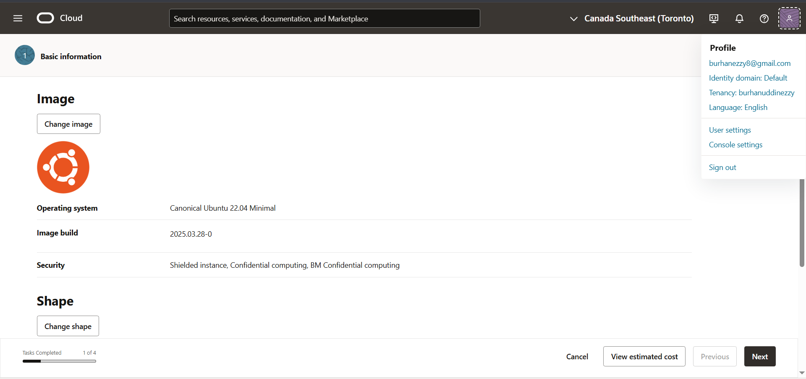
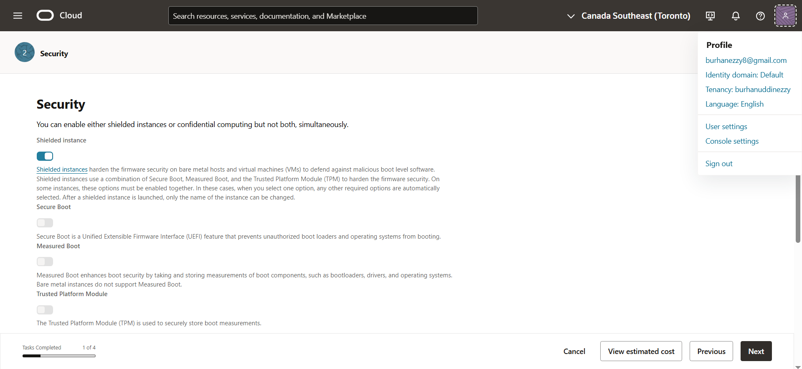
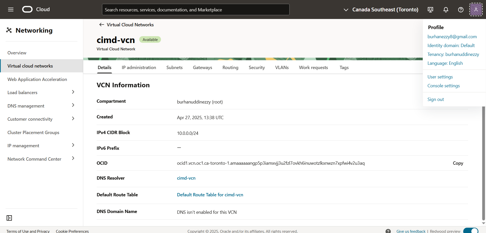
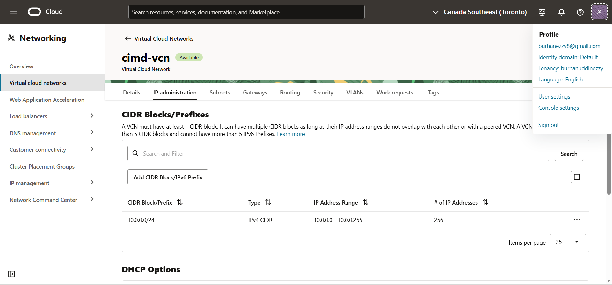

# Manual Setup Handbook

A step-by-step guide to building the Cloud Infrastructure Monitoring Database (CIMD) entirely by hand — no automation.

**This project was intentionally set up manually** — every step, from provisioning the database to writing SQL and inserting data, was performed without automation or prebuilt setup scripts. The purpose was to:

- Deepen hands-on knowledge.
- Troubleshoot and problem-solve in real time.
- Understand what actually goes on behind the scenes.
- Build credibility for roles that demand cloud infrastructure and database experience.

**📸 Proof of Manual Work:**

- Screenshots for each step (e.g., creating resources, writing queries, running commands).
- Written explanations of decisions, mistakes, fixes, and why each step was done a certain way.
- Clear separation from any auto-generated setup (no Terraform, no auto-ingestion pipelines, etc.).
- Scripts and queries written manually, line-by-line.

🧰 Manual PostgreSQL Database Setup on Oracle Cloud (Compute VM)
📝 Overview
This guide walks through setting up a manual PostgreSQL database on Oracle Cloud Infrastructure (OCI) using a Compute instance instead of Autonomous DB. This approach gives complete control over installation, configuration, and maintenance — ideal for showcasing DevOps and cloud fundamentals.

✅ Prerequisites
Before starting:

An active Oracle Cloud Free Tier account

Basic Linux command-line knowledge

SSH key pair (for VM access)

Installed: ssh, scp, and optionally pgAdmin or DBeaver on your local machine

# Step 1: Launch a Compute Instance (VM)

Go to OCI dashboard > Compute > Instances

Click Create Instance

Configure:

Name: postgresql-vm

## Image: Choose Canonical Ubuntu (latest)

✅ Why Canonical Ubuntu 22.04 Minimal?
22.04 LTS = Long Term Support (supported until 2027 or later)

        It’s stable, widely used, and compatible with most software including PostgreSQL.

        Minimal means it’s lightweight — faster boot, fewer background services.

        24.04 just came out (April 2024), so it may have compatibility bugs.

        20.04 is older and nearing the end of its mainstream support in a couple years.

## Shape: Select the Always Free one (VM.Standard.A1.Flex, 1 OCPU, 1 GB RAM)

    Click "Change Shape"

        Under "Shape Series", select: VM.Standard.A1.Flex

        Under "OCPUs", set it to: 1 OCPU

        Under "Memory", set it to: 1 GB RAM

Enabled Shielded Instance for firmware hardening and security best practices (no additional cost).

## Networking

    - Created a new VCN with internet connectivity to allow external access to the instance.
    - Chose Public Subnet to enable public internet communication.
    - Assigned a public IPv4 address to the instance for SSH access.
    - Left hostname as default (or set custom name: cimd-server-01).

**VNIC Name**: Set to cimd-server-vnic to clearly and consistently identify the network interface associated with the database server instance.

**Primary Network Selection:**

- Option: Create new virtual cloud network (VCN)
<!-- Reason: Manually creating a new VCN ensures full control over networking configuration, properly isolates the database server, and showcases complete infrastructure setup skills. -->

**Networking Configuration:**

- Virtual Cloud Network (VCN) Name: cimd-vcn
- Subnet Name: cimd-subnet
- VCN CIDR Block: 10.0.0.0/24
<!--Reasoning:
- Clear naming convention tied to project (CIMD).
- /24 CIDR block provides sufficient IP range for testing, demonstration, and future scaling within a single subnet.
- Manual network creation demonstrates full understanding of cloud network setup fundamentals.-->

## Mistake: Private IP Auto-Assign Not Enabled During Instance Creation

**Issue:**
While setting up the instance, I noticed that the option to automatically assign a private IPv4 address was disabled and could not be enabled. This caused a significant issue, as I wasn't able to set up the instance with the correct network settings at this stage.

**Cause:**
The issue arose from using the quick setup wizard to create the Virtual Cloud Network (VCN) and subnet directly within the instance creation process. This simplified method doesn't provide all the necessary options to configure network settings correctly, especially the automatic private IP assignment.

**VCN and subnet settings**: The quick setup option doesn't properly set up things like Internet Gateways and Routing Tables, which are required for proper networking and automatic IP assignment.

**Solution:**
To resolve this, I need to follow a manual approach to creating the VCN and subnet separately before creating the instance. By manually setting up the VCN with Internet Connectivity, I can ensure that the instance has the right networking configurations and that the private IP is automatically assigned during instance creation.

**Steps to Correct the Issue:**

### Create a VCN Manually:

- Go to Networking → Virtual Cloud Networks → Create VCN

  - Name: cimd-vcn
  - CIDR Block: Use 10.0.0.0/24 as the CIDR block for your VCN. This is a private IP range and is commonly used for internal networking. It provides up to 256 IP addresses, which is sufficient for our initial setup.
  - I left the "Use DNS hostnames in this VCN" checkbox unchecked, as I don't need DNS resolution for my instances at this stage and will use IP addresses for communication instead of hostnames.
  - I left the "Assign an Oracle allocated IPv6 /56 prefix" box unchecked since IPv6 is not required for my current setup, and I don't anticipate needing it for the immediate configuration of the database server.
  - I left the field for adding ULA prefixes blank, as the current setup does not require IPv6 addressing. Since this project does not involve IPv6 communication or private IPv6 addresses, adding ULA prefixes is unnecessary for the scope of this setup.
  - I chose not to add any tags to the VCN at this stage since this is a personal project, and there are no specific tagging policies required for this setup. The primary focus was on the infrastructure and database setup itself. Tags can be added later if necessary for better organization, but for now, they are not essential.
  - I chose to skip custom security attributes for the instance, relying on the default settings for now. This decision was made to keep the setup simple while focusing on the primary goal of setting up the database instance. Further security adjustments, such as configuring firewalls or NSGs, can be added later based on evolving project needs.

Create the Compute Instance:

- After creating the VCN, go back to the Compute section and select Create Instance.
- For the Virtual Cloud Network selection, choose the cimd-vcn VCN you created earlier.
- Ensure the public subnet you created earlier is selected.
- The private IP address will now be automatically assigned, and the instance will be correctly connected to the VCN.

By following these steps, I can proceed with the proper network configuration for the instance and ensure it functions as expected.

📸 Take a screenshot of your configuration summary.
