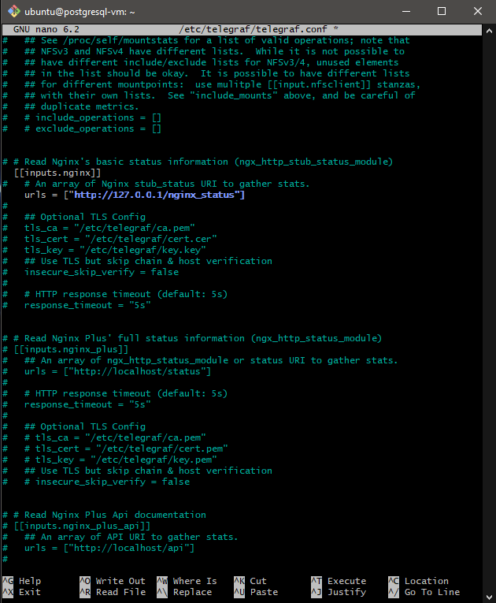
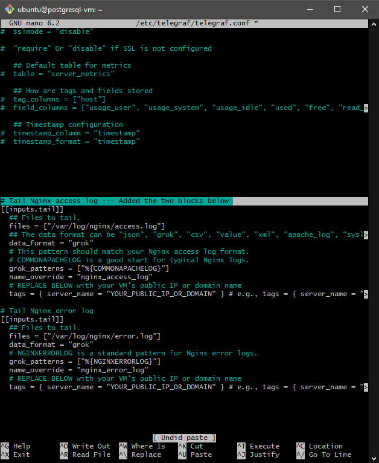

# Overview
Collecting application logs is crucial for a comprehensive Cloud Infrastructure Monitoring Database (CIMD), providing application-level insights beyond server metrics. To showcase this capability and my understanding of holistic monitoring essential for modern DevOps, I've installed Nginx and configured Telegraf to ingest its logs. This demonstrates my ability to gather vital data on application behavior, user interactions, and errors, offering a fuller picture of system health for effective troubleshooting and observability.

# Step 1: Update Package Lists

First, I'll ensure my system's package lists are up to date:

Bash

sudo apt update
sudo: This command allows me to run commands with superuser (administrator) privileges, which I'll need for most system-level operations.

apt: This is the command-line package manager for Debian-based systems like Ubuntu, used to install, upgrade, and remove software.

update: This tells apt to refresh the list of available packages from the repositories, ensuring my system knows about the latest software versions.

# Step 2: Install Nginx

Next, I'll install the Nginx web server package:

Bash

sudo apt install nginx -y

sudo apt install nginx: This command tells apt to download and install the nginx package and its dependencies.
-y: This flag automatically answers "yes" to any prompts, making the installation process quicker.

# Step 3: Verify Nginx Installation

After installation, Nginx should start automatically. I'll verify its status:

Bash

sudo systemctl status nginx

sudo systemctl status nginx: This asks systemctl to display the current status of the nginx service. I'll look for Active: active (running) in the output. I can also open a web browser and enter the public IP address of my cloud VM to see the default "Welcome to nginx!" page.

# Step 4: Configure the Firewall (if necessary)

If I have a firewall enabled (like ufw; I don't but adding this step in incase someone who is following this to build, the steps are here to deal with a firewall), I might need to allow traffic on port 80 (HTTP):

Bash

sudo ufw allow 'Nginx HTTP'

sudo ufw allow 'Nginx HTTP': This tells ufw to allow incoming traffic on port 80. I'll check the status of ufw with sudo ufw status if I'm unsure if it's active.

# Step 5: Create a Simple Website Directory

I'll create a directory to hold my simple website files:

Bash

sudo mkdir -p /var/www/simple_site/html

sudo mkdir -p /var/www/simple_site/html: This creates the /var/www/simple_site/html directory, and the -p ensures that any necessary parent directories are also created.

# Step 6: Create a Simple HTML File (index.html)

I'll create an index.html file with some basic content:

Bash

sudo nano /var/www/simple_site/html/index.html

Then I'll paste in the HTML code for the welcome page and save the file (Ctrl+O, Enter, Ctrl+X).

Sample HTML (For Index.html which is the home page):
    <!DOCTYPE html>
    <html lang="en">
    <head>
        <meta charset="UTF-8">
        <meta name="viewport" content="width=device-width, initial-scale=1.0">
        <title>Simple Website</title>
    </head>
    <body>
        <h1>Welcome to my Simple Website!</h1>
        
This is a basic HTML page for testing Nginx logs.

        <ul>
            <li><a href="/page1.html">Page 1</a></li>
            <li><a href="/page2.html">Page 2</a></li>
            <li><a href="/api/data">API Data (will likely be a 404)</a></li>
        </ul>
    </body>
    </html>

Execute the sudo nano command you already have, which opens the index.html file in the nano text editor.

Bash
sudo nano /var/www/simple_site/html/index.html

After running this, your terminal screen will change to the nano editor interface. It will likely be a blank screen with some nano commands listed at the bottom.

Once the code is pasted, I'll save the changes.

# Step 7: Create Additional Simple HTML Files (page1.html, page2.html)

Similarly, I'll create page1.html and page2.html with their respective simple content using sudo nano.

# Details for the simple site I've generated
- The pages below generate a diverse and rich set of Nginx access and error log data, which is essential for demonstrating a truly comprehensive cloud monitoring solution when integrated with tools like Telegraf and PostgreSQL.
    1. **index.html (My Homepage)**
        Log Data Contribution:
        - Standard Visits: Every time someone hits the homepage, I log a standard GET / HTTP/1.1 200.
        - Internal Browse: I've included links to my other pages (/services.html, /about.html, /contact.html), so each click generates a new GET request for that specific path.
        - Simulated Interactions: The contact form on this page sends a POST /submit-form HTTP/1.1 200 request when submitted. This is key for showing how Nginx logs different HTTP methods and successful form interactions.
        - Intentional Errors: I've added explicit links to trigger specific error logs:
        - GET /api/data HTTP/1.1 404: This intentionally links to a non-existent API endpoint, guaranteeing a 404 Not Found error in the Nginx logs.
        - GET /error.html HTTP/1.1 500: This path is specifically configured in Nginx to return a 500 Internal Server Error, giving me a direct way to log server-side issues.
        - Client-Side (Optional): I also included a button to simulate a JavaScript error, which is useful if you're demonstrating full-stack monitoring that tracks client-side issues, even though Nginx doesn't log it directly.
    2. **services.html (My Services Page)**
        Log Data Contribution:
        - Specific Service Views: Every time this page is accessed, I log a GET /services.html HTTP/1.1 200, simulating user interest in particular service offerings.
        - Further Engagement: It includes links back to the contact page (e.g., "Talk to an Expert"), generating more GET requests as users explore.
    3. **about.html (My About Us Page)**
        Log Data Contribution:
        - Background Exploration: Each visit to this page logs a GET /about.html HTTP/1.1 200, showing when users are looking into the project's background.
        - Engagement Paths: Calls to action link to the contact page, driving further GET requests.
    4. **contact.html (My Contact Page)**
        Log Data Contribution:
        - User Outreach Intent: Accessing this page logs a GET /contact.html HTTP/1.1 200, indicating a user's intent to connect.
        - Form Interaction: The contact form here sends a POST /submit-contact HTTP/1.1 200 request. This adds another layer of diverse POST log data for different form interactions.
        - Page Redirects: Links back to the services page also generate standard GET requests.
    5. **404.html (My Custom Not Found Page)**
        Log Data Contribution:
        - Client-Side Errors: When Nginx serves this page (e.g., if a user follows the "Test API (404)" link to /api/data, or types a wrong URL), it logs a GET /non-existent-path HTTP/1.1 404 entry. This explicitly demonstrates that I'm handling and logging 4xx client-side errors effectively.
    6. **500.html (My Custom Internal Server Error Page)**
        Log Data Contribution:
        - Server-Side Errors: When the "Simulate Error (500)" link (/error.html) is accessed, it generates a GET /error.html HTTP/1.1 500 entry in your Nginx logs. This is crucial for showing that I'm logging 5xx server errors, which are often the most critical for a monitoring system to detect.

    In essence, by crafting these distinct pages with various internal links, simulated form submissions, and explicit error triggers, I've turned this static website into a perfect traffic generator for my Nginx server. This ensures that my Nginx access and error logs will be populated with a wide array of HTTP methods, requested paths, and status codes (200, 404, 500).

# Step 8: Configure Nginx to Serve My Simple Website

I'll navigate to the Nginx configuration directory:

Bash

cd /etc/nginx/sites-available/

And create a new configuration file:

Bash

sudo nano simple_site

Then I'll paste in the Nginx server block configuration, making sure to replace your_server_ip with the actual public IP address of my cloud VM.

I'll save and close the file.

# Step 9: Enable My New Site Configuration

I'll create a symbolic link to enable my new site configuration:

Bash

sudo ln -s /etc/nginx/sites-available/simple_site /etc/nginx/sites-enabled/

# Step 10: Disable the Default Nginx Site

I'll disable the default Nginx configuration:

Bash

sudo rm /etc/nginx/sites-enabled/default

# Step 11: Test the Nginx Configuration

Before restarting, I'll test my configuration for errors:

Bash

sudo nginx -t

I'll check for syntax is ok and test is successful in the output.

# Step 12: Restart Nginx

I'll apply my new configuration by restarting Nginx:

Bash

sudo systemctl restart nginx

# Step 13: Access My Simple Website

This step is about testing everything you've set up so far and observing the results.

13.1. Get Your Server's Public IP Address
If you don't have it handy, you'll need the public IP address of your cloud VM.

How to find it:

AWS EC2: Go to your EC2 Instances dashboard, select your instance, and the "Public IPv4 address" will be listed in the "Details" tab.
DigitalOcean: Go to your Droplets page, and the public IP address will be clearly displayed next to your Droplet's name.
Google Cloud: Go to "VM instances" and look for the "External IP" column next to your instance.
Other Providers: Check your cloud provider's VM or instance management dashboard; the public IP is usually prominently displayed.
Example: Let's assume your public IP address is 40.233.74.182 as in your previous example.

13.2. Open Your Web Browser
Use any standard web browser (Chrome, Firefox, Edge, Safari, etc.) on your local computer.

13.3. Navigate to Your Server's Public IP Address
In the address bar of your web browser, type your server's public IP address and press Enter.

What to type (example):
40.233.74.182
What you should see: You should now see your index.html (Homepage), styled with the "CIMD Pro" logo and minimalist royalty theme. This confirms Nginx is correctly serving your website files.

**13.33. Troubleshooting. If it doesnt load the site**
Troubleshooting Steps for ERR_CONNECTION_TIMED_OUT
1. Verify Nginx Service Status
First, let's confirm Nginx is actually running on your VM.

SSH into your VM.
Check Nginx status:
Bash

sudo systemctl status nginx

Expected Output: You should see Active: active (running) in green.
If it's not running:
If it shows inactive (dead) or failed, try to start it:
Bash

sudo systemctl start nginx

Then check status again: sudo systemctl status nginx.
If it fails to start, check the Nginx error logs for clues:
Bash

sudo tail -f /var/log/nginx/error.log

Look for any emerg or crit messages. You might have a syntax error in your Nginx config. If so, go back to Step 8.6 (sudo nginx -t) to test your config.

2. Check the VM's Operating System Firewall (UFW)
Many Linux distributions, especially Ubuntu, use UFW (Uncomplicated Firewall). This might be blocking incoming connections to port 80.

SSH into your VM.
Check UFW status:
Bash

sudo ufw status
Expected Output:
If you see Status: inactive, UFW is not running and isn't the problem.
If you see Status: active, then look for 80/tcp ALLOW or Nginx HTTP ALLOW.
If UFW is active and port 80 is NOT allowed:
Allow HTTP (port 80):
Bash

sudo ufw allow 'Nginx HTTP'
# OR, if 'Nginx HTTP' profile isn't available:
# sudo ufw allow 80/tcp
If you enabled OpenSSH previously, make sure it's still allowed:
Bash

sudo ufw allow 'OpenSSH'
Reload UFW:
Bash

sudo ufw reload
Check status again to confirm: sudo ufw status
3. Crucial: Check Your Cloud Provider's Firewall/Security Group Settings
This is the most common reason for connection timeouts. Your cloud provider (AWS, DigitalOcean, Google Cloud, Azure, etc.) has its own virtual firewall that sits in front of your VM. You must configure this to allow incoming traffic on port 80.

Log into your cloud provider's web console/dashboard.
Navigate to your VM instance settings.
Look for sections like:
AWS: "Security Groups" (attached to your EC2 instance).
DigitalOcean: "Firewalls" (can be attached to Droplets).
Google Cloud: "Firewall rules" (associated with your VPC network and applied to instances).
Azure: "Network Security Groups" (NSGs) (attached to your VM's network interface).
Find the firewall/security group associated with your VM.
Edit the inbound rules (or ingress rules).
Add a new rule that allows:
Protocol: TCP
Port Range/Destination Port: 80 (or HTTP if there's a predefined service)
Source/Source IP: 0.0.0.0/0 (This means "anywhere" or "all IPs." For a demo, this is fine. In production, you might restrict it to specific IPs).
Description (Optional): Allow HTTP traffic
Save the changes to the firewall/security group rules. These changes usually take effect very quickly.
4. Double-Check Your Server's Public IP Address
It's a simple mistake, but sometimes people use a private IP address or an old IP.

Confirm the IP address you're typing into the browser is indeed the public IP address listed in your cloud provider's dashboard for your running VM.
After performing these checks, especially Step 3 (Cloud Provider Firewall), try accessing your website again in your browser using the public IP address.

Troubleshooting Nginx Connection Issues on Oracle Cloud Infrastructure (OCI) Ubuntu VMs
This section outlines a common issue encountered when deploying an Nginx web server on an Oracle Cloud Infrastructure (OCI) Ubuntu VM, where the website is inaccessible via its public IP address with an ERR_CONNECTION_TIMED_OUT error, even when OCI's Security List and Network Security Group (NSG) rules are correctly configured and Nginx is running.

1. Problem Description
After configuring Nginx and opening necessary ports (e.g., 80 for HTTP) in Oracle Cloud Infrastructure's firewall rules (Security Lists and/or Network Security Groups), attempts to access the web server from a browser or external port checker (portchecker.io) result in a "connection timed out" error. Internal checks show Nginx is active (running).

2. Root Cause: Active iptables on Ubuntu VM
The root cause is often that Oracle-provided Ubuntu VM images come with iptables configured to block incoming connections by default, even if ufw (Uncomplicated Firewall) is inactive. The iptables rules act as a local firewall on the VM, preventing traffic from reaching Nginx, regardless of OCI's cloud-level firewall settings.

A common iptables configuration includes a broad REJECT rule at the end of the INPUT chain, which catches any traffic not explicitly allowed by preceding rules.

3. Diagnosis
To diagnose this, you can:

Use an External Port Checker:

Go to a service like https://portchecker.co/ or https://www.canyouseeme.org/.
Enter your VM's public IP address and port 80.
If the result is "False" or "Timed Out" (and Nginx is running), this indicates a firewall blocking the connection before it reaches Nginx.
Check iptables rules on your VM:

SSH into your Ubuntu VM.
Run the command to list iptables rules verbosely:
Bash

sudo iptables -L -n -v
Look for the INPUT chain. You will likely find a rule similar to this at the end of the INPUT chain:
REJECT     all  --  * * 0.0.0.0/0            0.0.0.0/0            reject-with icmp-host-prohibited
And notice the absence of an ACCEPT rule specifically for tcp dpt:80.
4. Solution: Adding an iptables Rule for HTTP (Port 80)
To resolve this, you need to add an iptables rule on your VM to explicitly allow incoming traffic on port 80, and then make this rule persistent.

SSH into your Ubuntu VM.

Add the iptables rule for port 80:
This command inserts a new rule into the INPUT chain to accept new and established TCP connections on port 80. By default, -I INPUT inserts it at position 1 (top of the chain), ensuring it's evaluated before the general REJECT rule.

Bash

sudo iptables -I INPUT -p tcp --dport 80 -m state --state NEW,ESTABLISHED -j ACCEPT
-I INPUT: Inserts the rule at the beginning of the INPUT chain.
-p tcp: Specifies the TCP protocol.
--dport 80: Specifies the destination port is 80.
-m state --state NEW,ESTABLISHED: This matches new incoming connections (NEW) and established connections (ESTABLISHED), which is standard practice for stateful firewalls.
-j ACCEPT: Specifies that matching traffic should be accepted.
Make iptables changes persistent:
Rules added with the iptables command are lost on VM reboot. To make them permanent, use netfilter-persistent.

Bash

sudo apt install netfilter-persistent # Install if not already installed
sudo netfilter-persistent save
This command saves the current iptables rules to configuration files (/etc/iptables/rules.v4 and rules.v6) which are automatically loaded on system boot.

5. Verification
After performing these steps:

Re-check with portchecker.io: Go to https://www.google.com/url?sa=E&source=gmail&q=https://portchecker.co/ and check port 80 on your public IP. It should now show "Open" or "Success".
Access your website: Open your web browser and navigate to your VM's public IP address (e.g., http://40.233.74.182). Your Nginx simple website should now be visible.
Important Note: This iptables configuration is in addition to the firewall rules configured at the Oracle Cloud Infrastructure level (Security Lists and Network Security Groups). Both layers must permit the traffic for your application to be accessible from the internet.

----------------------------------------------

13.4. Interact with the Website to Generate Diverse Log Entries
Now that the site is live, start clicking around and performing actions to create varied entries in your Nginx access and error logs.

Browse Standard Pages (200 OK GET requests):

Click on "Our Services" in the navigation bar. (Generates GET /services.html HTTP/1.1 200)
Click on "About Us". (Generates GET /about.html HTTP/1.1 200)
Click on "Contact". (Generates GET /contact.html HTTP/1.1 200)
Click on the "View Our Services" button on the homepage. (Generates GET /services.html HTTP/1.1 200)
Click on the "Talk to an Expert" button on the Services or About page. (Generates GET /contact.html HTTP/1.1 200)
Simulate Form Submissions (200 OK POST requests):

Go to the Homepage (/). Scroll down to the "Got a question?" form. Fill in some dummy data (e.g., Name: Test User, Email: test@example.com, Message: Hello, this is a test!).
Click the "Send Test Message" button.
What you'll see: A small "Form submission simulated." message in your browser (because Nginx is returning that JSON).
What it logs: POST /submit-form HTTP/1.1 200
Go to the Contact page (/contact.html). Fill in some dummy data in that form.
Click the "Submit Inquiry" button.
What you'll see: A small "Contact form submission simulated." message.
What it logs: POST /submit-contact HTTP/1.1 200
Generate a 404 Not Found Error:

Click the "Test API (404)" link in the navigation bar.
What you'll see: Your custom 404 - Page Not Found page.
What it logs: GET /api/data HTTP/1.1 404
Alternatively, in your browser's address bar, type your IP address followed by a non-existent path (e.g., 40.233.74.182/nonexistentpage) and press Enter.
What you'll see: Your custom 404 - Page Not Found page.
What it logs: GET /nonexistentpage HTTP/1.1 404
Generate a 500 Internal Server Error:

Click the "Simulate Error (500)" link in the navigation bar.
What you'll see: Your custom 500 - Internal Server Error page.
What it logs: GET /error.html HTTP/1.1 500

13.5. Verification (Optional but Recommended)
To confirm that these actions are indeed generating logs, you can quickly check your Nginx access log file on your VM after performing some of these actions.

SSH back into your VM.
View the Nginx access log:
Bash

tail -f /var/log/nginx/access.log

This command will display the last few lines of the access.log file and then continue to display new lines as they are added.
While the tail -f command is running in one terminal window, go back to your web browser and interact with the site again. You should see new log entries appearing in your terminal as you click links, submit forms, or generate errors.

To stop tail -f, press Ctrl+C.

Now you have a simple website running on your Nginx server, actively generating rich access and error logs that Telegraf will be configured to collect. This creates the essential raw data for your monitoring demonstration!

------------------------------------ 
**Enable Nginx stub_status Module (for Nginx Performance Metrics)**
Telegraf's inputs.nginx plugin needs access to Nginx's status page to collect performance metrics like active connections, requests handled, etc.

Edit your Nginx site configuration file:

Bash

sudo nano /etc/nginx/sites-available/simple_site
Inside your server block, add a new location block for the stub_status module. Place it, for example, just before your location / { ... } block.
Important: Replace your_public_ip with the actual public IP address of your VM (e.g., 40.233.74.182).

Nginx

server {
    listen 80;
    server_name your_public_ip; # <-- REPLACE WITH YOUR ACTUAL PUBLIC IP

    # Add this block for Nginx status
    location /nginx_status {
        stub_status on;
        access_log off;
        allow 127.0.0.1; # Allow access ONLY from localhost (Telegraf)
        deny all;        # Deny all other IPs for security
    }

    location / {
        root /var/www/simple_site/html;
        index index.html index.htm;
        try_files $uri $uri/ =404;
    }

    # ... other configurations ...
}
Security Note: allow 127.0.0.1; ensures that only Telegraf (running on the same VM) can access this sensitive status page, preventing public exposure.
Save the file: Press Ctrl+O, then Enter, then Ctrl+X in nano.

Test Nginx configuration for syntax errors:

Bash

sudo nginx -t
You should see "syntax is ok" and "test is successful". If you see errors, double-check your nano edits.

Reload Nginx to apply changes:

Bash

sudo systemctl reload nginx
Verify access (optional, from within the VM):

Bash

curl http://127.0.0.1/nginx_status
You should see raw Nginx status metrics like "Active connections", "server accepts handled requests", etc. If you get a "Connection refused" or blank output, something is wrong with the Nginx configuration for stub_status.

Step 3: Configure Telegraf Inputs for Nginx Metrics and Logs
Now, we'll tell Telegraf what data to collect.

Open the main Telegraf configuration file:

Bash

sudo nano /etc/telegraf/telegraf.conf
Uncomment/Add the inputs.nginx plugin configuration.

Search for [[inputs.nginx]] (you can press Ctrl+W in nano to search, type [[inputs.nginx]] and press Enter).
If the lines below are commented out (start with #), remove the # at the beginning of each line to uncomment them.
Ensure the urls point to the nginx_status endpoint you created.
<!-- end list -->

Ini, TOML

Read Nginx stats (ngx_http_stub_status_module)
[[inputs.nginx]]
   An array of Nginx stub_status URI to gather stats.
  urls = ["http://127.0.0.1/nginx_status"]
   Optional: tag all collected metrics with the hostname
   hostname = "$HOSTNAME" # You can uncomment this if you want to include the VM's hostname as a tag

Add the inputs.tail plugin for Nginx access and error logs.

Scroll to the end of the telegraf.conf file, or find a suitable place to add these blocks.
<!-- end list -->

Ini, TOML

# Tail Nginx access log
[[inputs.tail]]
  ## Files to tail.
  files = ["/var/log/nginx/access.log"]
  ## The data format can be "json", "grok", "csv", "value", "xml", "apache_log", "syslog".
  data_format = "grok"
  # This pattern should match your Nginx access log format.
  # COMMONAPACHELOG is a good start for typical Nginx logs.
  grok_patterns = ["%{COMMONAPACHELOG}"]
  name_override = "nginx_access_log"
  # REPLACE BELOW with your VM's public IP or domain name
  tags = { server_name = "YOUR_PUBLIC_IP_OR_DOMAIN" } # e.g., tags = { server_name = "40.233.74.182" }

# Tail Nginx error log
[[inputs.tail]]
  ## Files to tail.
  files = ["/var/log/nginx/error.log"]
  data_format = "grok"
  # NGINXERRORLOG is a standard pattern for Nginx error logs.
  grok_patterns = ["%{NGINXERRORLOG}"]
  name_override = "nginx_error_log"
  # REPLACE BELOW with your VM's public IP or domain name
  tags = { server_name = "YOUR_PUBLIC_IP_OR_DOMAIN" } # e.g., tags = { server_name = "40.233.74.182" }

Important on Log Parsing: The grok_patterns (%{COMMONAPACHELOG} and %{NGINXERRORLOG}) are for standard Nginx log formats. If you've customized your Nginx log format, you might need to create custom Grok patterns. For now, these defaults are a good starting point.

Replace YOUR_PUBLIC_IP_OR_DOMAIN with your actual Nginx web server's public IP address (or domain name if you've set one up). This tag helps identify the source of the logs in your monitoring system.
Step 4: Configure Telegraf Output for Prometheus
We need to tell Telegraf to expose its collected metrics in a format that Prometheus can scrape.

In the same telegraf.conf file, search for [[outputs.prometheus_client]] (use Ctrl+W to search).

Uncomment/add it, ensuring the listen port is set.

Ini, TOML

# Prometheus client
[[outputs.prometheus_client]]
  ## Address to listen on.
  listen = ":9273" # This is a common port for Telegraf's Prometheus output
  ## If true, no telegraf metrics will be emitted.
  # no_default_metrics = false
  ## If true, metrics will not be sorted.
  # no_sort = false
  ## If true, metrics will not be grouped by output.
  # no_group_by_output = false
listen = ":9273": Telegraf will now listen on port 9273 on your postgresql-vm. Prometheus will later connect to this port to retrieve the metrics.
Save and close the telegraf.conf file. (Press Ctrl+O, then Enter, then Ctrl+X in nano).

Step 5: Start/Restart Telegraf Service
Apply the new configuration by restarting the Telegraf service:

Bash

sudo systemctl restart telegraf
sudo systemctl enable telegraf # Ensures Telegraf starts automatically on boot
sudo systemctl status telegraf
Check the status. It should show active (running). If you see failed or other errors, check Telegraf's logs for error messages: sudo journalctl -u telegraf -f. (Press Ctrl+C to exit the journalctl view).
Step 6: Verify Telegraf Metrics Endpoint (from within the VM)
You can check if Telegraf is exposing metrics correctly. While still SSHed into your postgresql-vm:

Bash

curl http://127.0.0.1:9273/metrics
You should see a significant amount of text output. This text represents the metrics collected by Telegraf (system metrics, Nginx performance metrics, and metrics derived from your Nginx logs) in a format that Prometheus can understand. This confirms Telegraf is running and collecting data.
Step 7: Open Firewall for Telegraf (if Prometheus is on a Separate VM)
This step depends on whether you plan to install Prometheus on the same VM as Nginx/PostgreSQL, or on a separate, dedicated monitoring VM.

If Prometheus is on the SAME VM: You do NOT need to open any additional firewall ports for 9273 in OCI or iptables, because Prometheus will connect to 127.0.0.1:9273 locally.

If Prometheus is on a SEPARATE VM (Recommended for real monitoring setups): You will need to open port 9273 on your postgresql-vm's firewalls to allow the Prometheus VM to connect and scrape metrics.

OCI Firewalls (Security List/NSG):

Go to your OCI Console -> Networking -> Virtual Cloud Networks -> Your VCN -> Your Security List/NSG.
Add an Ingress Rule:
Source Type: CIDR
Source CIDR: The private IP address of your future Prometheus VM (e.g., 10.0.0.100/32). Using the private IP is a security best practice for VM-to-VM communication within your VCN. For initial testing, 0.0.0.0/0 could be used, but restrict it later.
IP Protocol: TCP
Destination Port Range: 9273
iptables on postgresql-vm:

Bash

sudo iptables -I INPUT -p tcp --dport 9273 -s YOUR_PROMETHEUS_VM_PRIVATE_IP -j ACCEPT
sudo netfilter-persistent save
(Replace YOUR_PROMETHEUS_VM_PRIVATE_IP with the actual private IP of your Prometheus VM once you create it.)

