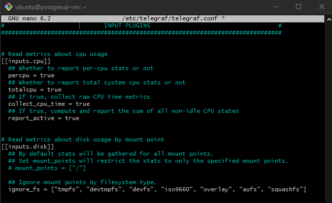
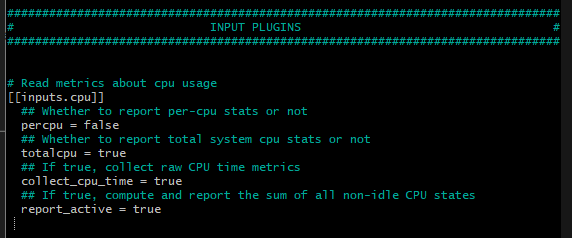

<!-- IMPORTANT COMMANDS
01. sudo nano /etc/telegraf/telegraf.conf - to check the I/O configurations
02. telegraf --test
03. telegraf --list-outputs
-->
# Step 1: Install Telegraf on Ubuntu 22.04.5 LTS

Open a terminal and SSH into your deployed Ubuntu server.

Update Package Lists: Ensure your system's package lists are up-to-date:

Bash
    sudo apt update
    
Install Telegraf: Use the apt package manager to install Telegraf:

Bash
    sudo apt install telegraf

This command will download and install the Telegraf package from the default Ubuntu repositories.

Verify Installation (Optional): You can check if Telegraf is installed and its version:

Bash
    telegraf --version

My version installed (for the record): Telegraf 1.21.4+ds1-0ubuntu2

# Step 2: Configure Telegraf on Ubuntu 22.04.5 LTS

The main Telegraf configuration file is located at /etc/telegraf/telegraf.conf. You'll need to edit this file with sudo nano:

Bash
    sudo nano /etc/telegraf/telegraf.conf

Review [agent] Settings: Examine the [agent] section for global configuration options. You can usually keep the defaults for the interval (10s) and hostname.

Enable Input Plugins ([[inputs.*]]): Uncomment and configure the input plugins to collect the metrics you need. Find the corresponding sections and make the following adjustments (at a minimum):

[[inputs.cpu]]: Uncomment this section. The default settings are generally sufficient to get overall and per-CPU usage.

[[inputs.mem]]: Uncomment this section. The defaults will collect memory usage statistics.

[[inputs.disk]]: Uncomment this section. Modify the ignore_fs line to exclude temporary and virtual file systems:

Ini, TOML
    [[inputs.disk]]
    ignore_fs = ["tmpfs", "devtmpfs", "devfs", "iso9660", "overlay", "aufs", "squashfs"]

- Explanation of the File System Types:
    - tmpfs: A temporary file system backed by RAM and/or swap.
    - devtmpfs: A file system that manages device files in /dev.
    - devfs: (Older systems) Another file system for device files, largely superseded by devtmpfs.
    - iso9660: The standard file system for CD-ROM media.
    - overlay: A file system that combines multiple directory trees into a single view (often used with containers).
    - aufs: Another union file system (like overlayfs).
    - squashfs: A compressed read-only file system.


<!-- Continue from here. Need to open up nano again, saving and closing it for now.-->
[[inputs.diskio]]: Uncomment this section. You can optionally specify specific devices to monitor using the devices option if you don't want all of them.

Ini, TOML
    [[inputs.diskio]]
    # devices = ["sda", "vda"] # Uncomment and list specific devices

[[inputs.net]]: Uncomment this section. You can optionally specify the network interfaces you want to monitor using the interfaces option (e.g., eth0, ens*).

Ini, TOML
    [[inputs.net]]
    # interfaces = ["eth0", "ens*"] # Uncomment and list specific interfaces

[[inputs.system]]: Uncomment this section. It collects system-wide information like uptime and load averages.

Configure Output Plugin ([[outputs.postgresql]]): Add the following section at the end of the telegraf.conf file to configure the PostgreSQL output:

Ini, TOML

[[outputs.postgresql]]
  host = "<your_cloud_db_endpoint>"
  port = 5432
  database = "<your_database_name>"
  user = "<your_db_username>"
  password = "<your_db_password>"
  sslmode = "require" # Or "disable" if SSL is not configured

  ## Default table for metrics
  table = "metrics"

  ## How are tags and fields stored
  tag_columns = ["host"]
  field_columns = ["usage_user", "usage_system", "usage_idle", "used", "free", "read_count", "write_count", "read_bytes", "write_bytes", "bytes_sent", "bytes_recv", "uptime"]

  ## Timestamp configuration
  timestamp_column = "timestamp"
  timestamp_format = "timestamp"
  
Remember to replace the <placeholders> with your actual cloud PostgreSQL connection details. The field_columns list is a starting point based on common metrics. You might need to adjust this later based on the exact fields Telegraf provides and the columns in your Metrics table.

## Understanding Telegraf Tags and Fields for PostgreSQL Output

When configuring Telegraf to output data to a PostgreSQL database, the `tag_columns` and `field_columns` settings within the `[[outputs.postgresql]]` section are crucial for determining how your monitoring data is structured in the `metrics` table.

**Fields: The Measurements**

* Fields represent the actual metric values you are collecting. These are the numerical measurements or readings that you want to store and analyze.
* Examples of fields in the context of server monitoring include:
    * `cpu_usage` (CPU utilization percentage)
    * `memory_usage` (memory utilization percentage)
    * `disk_read_ops_per_sec` (disk read operations per second)
    * `network_in_bytes` (bytes received on the network)
    * `uptime_in_mins` (server uptime in minutes)

* The `field_columns` setting in your Telegraf output configuration is a list of these field names. Telegraf will look for data points from your input plugins that contain these field names and write their corresponding values into the columns of the same name in your PostgreSQL `metrics` table.

**Tags: The Context and Identifiers**

* Tags are key-value pairs that provide metadata or context about the metric. They act as labels that help you identify *what* the metric is associated with.
* Examples of common tags in server monitoring include:
    * `host`: The hostname of the server the metric came from.
    * `cpu`: The specific CPU core the metric pertains to (e.g., `cpu0`, `total`).
    * `interface`: The network interface the metric is related to (e.g., `eth0`, `ens192`).

* The `tag_columns` setting in your Telegraf output configuration is a list of tag names. For each data point Telegraf processes, if it finds a tag with a name listed in `tag_columns`, it will create a separate column in your PostgreSQL `metrics` table with that tag's name and store the tag's value in that column for the corresponding metric reading. This allows you to easily filter and group your data based on these identifiers (e.g., see CPU usage *for a specific host*).

**How to Get the Desired Tags and Fields:**

To ensure your `metrics` table contains the `server_id` and `region` as columns (as per your requirements), you need to make sure Telegraf is providing this information as tags. Here's how you can approach this:

1.  **Review Telegraf Input Plugin Output:**
    * Use the `telegraf --test` command or check your Telegraf logs to see the exact structure of the data being produced by your configured input plugins (e.g., `[[inputs.cpu]]`, `[[inputs.mem]]`, `[[inputs.disk]]`, `[[inputs.net]]`).
    * Identify if `server_id` and `region` are already present as tags in the output of any of these plugins.

2.  **Utilize Telegraf Processor Plugins:**
    * If `server_id` and `region` are not standard tags from your input plugins, you can use Telegraf processor plugins to add them. Common processor plugins for this purpose include:
        * `[[processors.add_tag]]`: Allows you to add static tags or tags based on conditions. For example, you could add a `region` tag with a specific value for all servers in a particular configuration file.
        * `[[processors.rename]]`: Can rename existing tags or fields.
        * `[[processors.regex]]`: Allows you to extract tag values from field values or other tags using regular expressions.
        * `[[processors.exec]]`: Enables you to run external commands or scripts to generate tags based on your environment.

    * **Example using `[[processors.add_tag]]`:**
        ```toml
        [[processors.add_tag]]
          namepass = ["cpu", "mem", "disk", "net"] # Apply to these measurements
          tags = {"region" = "us-east-1"}

        [[processors.add_tag]]
          namepass = ["cpu", "mem", "disk", "net"]
          tags = {"server_id" = "your_static_server_id"} # Or use a variable/logic
        ```

    * **Example using `[[processors.rename]]` (if `server_id` exists as a field, you can make it a tag):**
        ```toml
        [[processors.rename]]
          namepass = ["*"]
          [[processors.rename.tag]]
            old = "serverIDFromInput" # Replace with the actual field name
            new = "server_id"
        ```

3.  **Configure `tag_columns` in `[[outputs.postgresql]]`:**
    * Once you are sure that `region` and `server_id` are being generated as tags by your input plugins or added by processor plugins, include them in the `tag_columns` list:
        ```toml
        [[outputs.postgresql]]
          # ... other settings ...
          tag_columns = ["host", "region", "server_id"]
          # ...
        ```

By understanding the distinction between tags and fields and how to manipulate them within your Telegraf configuration, you can effectively control the structure and content of the data written to your PostgreSQL database. Remember to restart the Telegraf service after making any changes to the configuration file.

Save and Close the Configuration File: Press Ctrl+X, then Y to confirm saving, and then Enter.

-------------------------------------------------
## My specific telegraf configuration process:
**This section will be a bit more detailed in what I'm doing specifically**
**What I've learnt so far**: The telegraf nano file is used for me to configure the input output of telegraf. Where input is what data it pulls from the cloud VM, and output being what data from the input it loads into the database. I need to configure both, in input, i need to make sure im getting telegraf to collect all the data groups like cpcu, mem, diskio, etc. that hold the data i want, AND also to make sure its not collecting data groups i wont need at all, for optimization since this will be running constantly, so it should only necessary data groups. In the output, I need to only get certain data points from the data groups it collects.

This is before i made any changes to the inputs (the screenshot specifically shows the CPU input)



This is where you can see all the tag and field data that is collected under CPU input: https://github.com/influxdata/telegraf/blob/release-1.34/plugins/inputs/cpu/README.md 

Telegraf has documentation like this for each input group. 

I only want it to collect certain data, so i need to add a fieldpass command and mention only the specific data fileds I want that need to be collected, so the rest isnt collected.

This is after I add usage_active (total non-idle cpu usage) for cpu usage. 

Here's a list of fieldpass for all the inputs I add:
 - [[inputs.cpu]] - fieldpass = ["usage_active"]

 usage_active (This is the total non-idle CPU usage) You could choose usage_active for a general CPU utilization percentage, or potentially calculate a total usage if needed using a processor plugin.

 - [[inputs.disk]] - fieldpass = ["used_percent"]

used_percent (float, percent): This is the current disk usage percentage.

 - [[inputs.diskio]] - fieldpass = ["reads","writes","read_bytes","write_bytes"]

disk_read_ops_per_sec: This can be derived from the reads field (which is a counter of read operations). To get the "per second" value, you'll likely need to use a Telegraf aggregator plugin like [[aggregators.rate]] on the reads field.

disk_write_ops_per_sec: Similarly, this can be derived from the writes field (a counter of write operations) using a [[aggregators.rate]].

disk_read_throughput: This can be derived from the read_bytes field (a counter of bytes read). You'll need to use a [[aggregators.rate]] to get the rate of bytes read per second.

disk_write_throughput: This can be derived from the write_bytes field (a counter of bytes written) using a [[aggregators.rate]].

- [[inputs.kernel]] - fieldpass = ["boot_time"]

boot_time (integer, seconds since epoch, btime): While not directly "uptime in minutes", you can use this as a reference point to calculate uptime. You would need to:
Get the current timestamp.
Subtract boot_time from the current timestamp to get uptime in seconds.
Divide by 60 to convert to minutes. This calculation could be done in your data visualization tool or potentially with a Telegraf processor plugin.

- [[inputs.mem]] - fieldpass = ["used_percent"]

memory_usage: This directly corresponds to the field used_percent (float, percentage), which represents the current memory utilization percentage.

- [[inputs.system]] - fieldpass = ["uptime"]

uptime_in_mins: This can be derived from the uptime field (integer, seconds). You would need to divide the uptime value by 60 to get the uptime in minutes. This calculation can be done in your data visualization tool or using a Telegraf processor plugin.

- [[inputs.net]] - fieldpass = ["bytes_recv","bytes_sent","err_in","err_out"]

this is for network_in_bytes and network_out_bytes

- [[inputs.ping]]  - fieldpass = ["average_response_ms"]

(float) average_response_ms is the latency_in_ms

**in inputs.ping, make sure to uncomment the urls = ["example.com"] and replace example with the IP or URL address of the services/servers/wesbites/APIs etc. that your cloud vm server will be interacting with, so it can send a ping to that and inform you of the latency. Also, uncomment count and set it to 1 which is normal enough for testing latency, it means it will send 1 data parcel to determine latency. Can always increase the count**
-------------------------------------------------
# Step 3: Start and Enable Telegraf on Ubuntu 22.04.5 LTS

Start the Telegraf service:

Bash

sudo systemctl start telegraf
Enable Telegraf to start on boot:

Bash

sudo systemctl enable telegraf
Check the Status of Telegraf: Verify that Telegraf is running without errors:

Bash

sudo systemctl status telegraf
Look for lines indicating that the service is active (running). If there are errors, examine the output for clues about configuration issues. You can also check the Telegraf logs using journalctl -u telegraf.

Next Steps:

After completing these steps, Telegraf should be running on your Ubuntu server and sending metric data to the metrics table in your cloud PostgreSQL database. Your next actions will be:

Verify Data in PostgreSQL: Connect to your cloud database using DBeaver or psql and query the metrics table to see if data is being inserted.
Adjust Table Schema: If the columns in the metrics table don't perfectly align with the data Telegraf is sending, you'll need to alter the table schema accordingly.
Refine Telegraf Configuration: Explore the specific fields available in the Telegraf input plugins you've enabled and adjust the field_columns in the postgresql output plugin to capture the metrics you need.
Address Specific Metrics: Investigate how to collect metrics like latency_in_ms, db_queries_per_sec, and error_count using Telegraf or supplementary methods.
This tailored guide should get Telegraf running on your Ubuntu 22.04.5 LTS server and sending data to your PostgreSQL database. Let me know if you encounter any issues during this setup!


